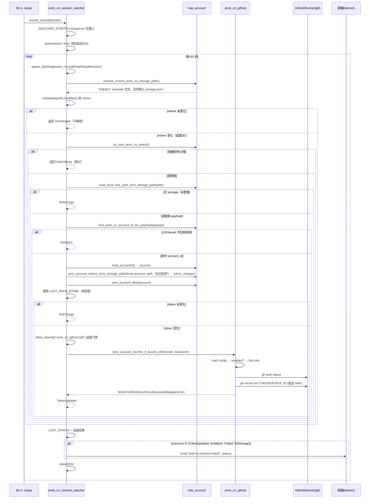
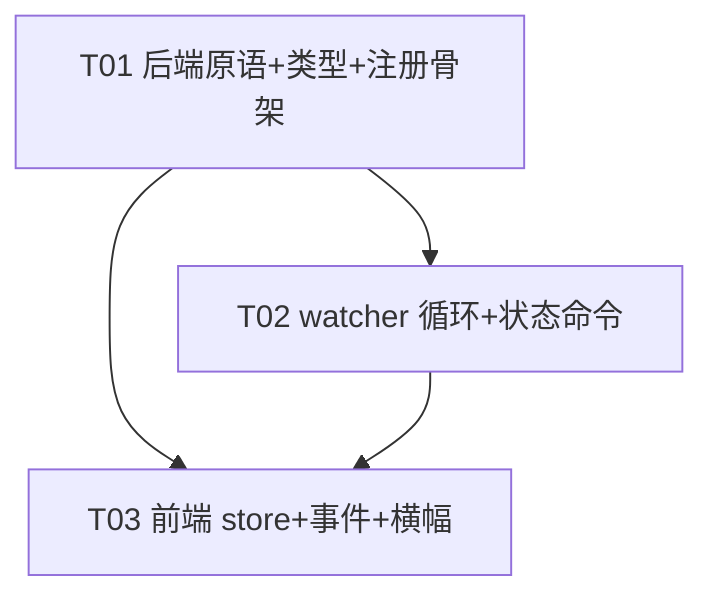

# 阶段 7 增量设计：四账号完整体验 + 后台会话同步

> 项目：TRAE Work CN 四账号切换器（cockpit-tools v1.3.16，分支 `codex/trae-work-cn-switcher`）
> 基线与前置：阶段 0–6 已提交（`741ce86f`，tag `work-cn-stage-6`）
> 本设计只覆盖**阶段 7**，不涉及阶段 8（清理/发布）。设计目标是让工程师**无需再读总纲即可实现**。
> 平台标识固定 `TraePlatformKind::TraeSoloCn` / `"trae_solo_cn"`，UI 显示名「TRAE Work CN」。

---

## 0. 硬约束（贯穿全部实现）

1. **只查询、只写 GitHub Secrets**：后台监测只做「读 storage → 匹配账号库 → 回写 → 必要时 `gh secret set`」，**绝不**触发 GitHub 签到/领取/计费（`gh workflow run` / `gh run` / `claim` / `check-in` 全部是禁区）。
2. **严格 TDD**：先写 Rust `#[cfg(test)] mod tests`（先失败 → 实现 → 通过）。前端无单测框架（`package.json` 仅有 `node --test` 跑一个 `.ts` + `typecheck`/`build`），前端验证以 `npm run typecheck` + `npm run build` 作为硬门禁，验收矩阵走人工 E2E。
3. **不调用本地签到**：watcher 只复用 `read_local_trae_auth_from_storage_path`（读+解析）与 `sync_account_tokens_from_storage_path`（回写账号库），不触碰任何 quota/claim 路径。

---

## 1. 实现方案 + 框架选型

### 1.1 核心难点

| 难点 | 处置 |
|---|---|
| 后台循环与前台命令/切换并发 | 复用全局切号锁 `WORK_CN_SWITCH_LOCK`，watcher 用 `try_lock` 非阻塞探测，占用即跳过 |
| 避免每 60s 反复解密 storage | 记录 `mtime`（`std::fs::metadata().modified()`），未变化直接跳过解密 |
| 复用既有私有原语（`sync_account_tokens_from_storage_path` 等） | 将 4 个 `fn` 提升为 `pub(crate)`，新增 3 个 `pub(crate)` 包装函数（详见 §2.3） |
| GitHub 同步逻辑散落在命令层 | 提取 `sync_account_secrets_if_bound` 供「切换链路占位 / watcher / 命令」三处共用 |
| 连续失败不刷屏 | 复用 `provider_token_keeper` 的退避表模式（`NEXT_ALLOWED_ATTEMPT_AT` + `allow_attempt`/`mark_attempt_failure_with_backoff`） |
| 后台 → 前端状态通知 | 复用 `tauri::Emitter`：watcher `app_handle.emit("work-cn:session-watch", &status)`；前端 `listen` 订阅 |

### 1.2 框架选型：完全复用 `provider_token_keeper.rs` 的模式

选择 `provider_token_keeper` 的「`ensure_started` + `AtomicBool` 防重入 + `tokio` sleep 循环 + 退避表」模式，**不引入任何新依赖**：

- `static WATCHER_STARTED: AtomicBool` → `ensure_started(app_handle)` 内 `swap(true)` 防重入；
- `tauri::async_runtime::spawn(async move { ... })` 起后台循环；
- 阻塞 I/O（读 storage、load/save account、跑 `gh`）用 `tauri::async_runtime::spawn_blocking` 包裹，避免阻塞 tokio 线程；
- 定时用 `tokio::time::sleep(Duration::from_secs(60))`；
- 退避用 `static NEXT_ALLOWED_ATTEMPT_AT: LazyLock<Mutex<HashMap<String, i64>>>`。

与 token_keeper 的差异点（仅这些）：
- 无需 `Notify` 配置变更唤醒（watcher 无配置项，固定 60s）；
- 启动延迟用 `10s`（token_keeper 是 5min），保证应用启动后横幅能较快出现首次结果，又避开启动瞬间与初始切换竞争；
- 引入 `LAST_SEEN_MTIME`（`LazyLock<Mutex<Option<SystemTime>>>`）与 `LAST_STATUS`（`LazyLock<Mutex<WorkCnSessionWatchStatus>>`）两份运行时状态。

---

## 2. 文件清单（区分新增/修改）

> 总纲给定的 5 个文件是「核心」；但为了让命令可被前端调用、类型可序列化，必须额外改动类型/命令/服务层文件。下表是**完整**清单。

### 2.1 新增（2 个）

```
src-tauri/src/modules/work_cn_session_watcher.rs   # 后台监测器（含内联 #[cfg(test)] 测试）
src/components/work-cn/WorkCnStatusBanner.tsx      # 前台监测状态横幅
```

### 2.2 修改（11 个）

```
src-tauri/src/modules/mod.rs            # + pub mod work_cn_session_watcher;
src-tauri/src/lib.rs                    # + ensure_started 调用；+ 1 条命令注册
src-tauri/src/modules/trae_account.rs   # 提升 4 个 fn 为 pub(crate)；新增 3 个 pub(crate)；接上切换链路 GitHub 占位
src-tauri/src/modules/work_cn_github.rs # + sync_account_secrets_if_bound(_with)
src-tauri/src/commands/work_cn_github.rs# 命令改用 sync_account_secrets_if_bound
src-tauri/src/commands/work_cn.rs       # + get_work_cn_session_watch_status 命令
src-tauri/src/models/work_cn.rs         # + WorkCnSessionWatchStatus / WorkCnSessionWatchOutcome
src/types/workCn.ts                     # + 对应 TS 接口
src/services/workCnService.ts           # + getWorkCnSessionWatchStatus + 事件名常量
src/stores/useWorkCnStore.ts            # + sessionWatchStatus 状态与 action
src/pages/WorkCnSwitcherPage.tsx        # 渲染横幅 + 注册事件监听
```

### 2.3 需新增/提升的 `pub(crate)` 原语（精确签名，工程师直接落地）

**A. `src-tauri/src/modules/trae_account.rs`**

```rust
// ① 切号锁暴露（现有 private static WORK_CN_SWITCH_LOCK 保持不变，仅加包装）
//    返回值借用 tokio::sync::Mutex::try_lock 的 OwnedMutexGuard，跨 await 安全。
pub(crate) fn try_lock_work_cn_switch() -> Option<tokio::sync::OwnedMutexGuard<()>> {
    WORK_CN_SWITCH_LOCK.try_lock().ok()
}

// ② 当前 Work CN storage 路径解析（含测试 override，与切换链路共用同一路径语义）
pub(crate) fn resolve_current_work_cn_storage_path() -> Result<PathBuf, String> {
    if let Some(path) = work_cn_switch_storage_path_override() {
        return Ok(path);
    }
    get_default_trae_storage_path_for_platform(TraePlatformKind::TraeSoloCn)
}

// ③ 读取+解密（现有 line 3629：fn → pub(crate) fn，签名不变）
pub(crate) fn read_local_trae_auth_from_storage_path(
    storage_path: &Path,
) -> Result<Option<TraeImportPayload>, String>

// ④ UID/email 匹配账号库（新增；逻辑等价于 sync_current_work_cn_session_from_local 的匹配块）
pub(crate) fn find_work_cn_account_id_for_payload(
    payload: &TraeImportPayload,
) -> Option<String> {
    let platform = TraePlatformKind::TraeSoloCn;
    let normalized_user_id = normalize_non_empty(payload.user_id.as_deref());
    let normalized_email = normalize_identity_email(Some(payload.email.as_str()));
    let accounts = list_accounts_checked().ok()?;
    accounts.iter()
        .find(|account| {
            resolve_account_platform_kind(account) == platform
                && account_matches_import_identity(
                    account,
                    normalized_user_id.as_deref(),
                    normalized_email.as_deref(),
                )
        })
        .map(|account| account.id.clone())
}

// ⑤ 应用 + 检测 token 变化（现有 line 5802：fn → pub(crate) fn，签名不变）
pub(crate) fn sync_account_tokens_from_storage_path(
    account: &mut TraeAccount,
    storage_path: &Path,
    source_label: &str,
) -> bool

// ⑥ 回写账号库（现有 line 491：fn → pub(crate) fn，签名不变）
pub(crate) fn save_account_file(account: &TraeAccount) -> Result<(), String>
```

同时**接上切换链路 GitHub 占位**（现有 line 4290 的 `sync_work_cn_github_for_switch`）：

```rust
async fn sync_work_cn_github_for_switch(account: &TraeAccount) -> bool {
    match crate::modules::work_cn_github::sync_account_secrets_if_bound(account) {
        Ok(result) => result.synced,
        Err(err) => {
            logger::log_warn(&format!(
                "[Work CN Switch] GitHub 同步失败（不阻止本地切号）: {err}"
            ));
            false
        }
    }
}
```

**B. `src-tauri/src/modules/work_cn_github.rs`**（新增两个函数，命令层逻辑上提）

```rust
/// 供 watcher/切换链路注入 FakeRunner 的可测版本。
pub(crate) fn sync_account_secrets_if_bound_with(
    runner: &dyn GitHubRunner,
    account: &TraeAccount,
) -> Result<WorkCnGitHubSyncResult, String> {
    let config = load_github_config();
    if !config.enabled {
        return Ok(skip_result(&account.id, "GitHub 同步未启用"));
    }
    let Some(slot) = find_slot_for_account(&config, &account.id) else {
        return Ok(skip_result(&account.id, "该账号未绑定 GitHub 槽位"));
    };
    sync_account_secrets(runner, account, slot, &config.repository)
}

/// 生产入口（命令层、切换链路、watcher 均走这里）。
pub(crate) fn sync_account_secrets_if_bound(
    account: &TraeAccount,
) -> Result<WorkCnGitHubSyncResult, String> {
    sync_account_secrets_if_bound_with(&RealGitHubRunner, account)
}

/// 构造「跳过」结果，与命令层原逻辑保持一致。
fn skip_result(account_id: &str, reason: &str) -> WorkCnGitHubSyncResult {
    WorkCnGitHubSyncResult {
        account_id: account_id.to_string(),
        synced: false,
        skipped: true,
        skip_reason: Some(reason.to_string()),
        error: None,
        synced_at: chrono::Utc::now().timestamp(),
    }
}
```

**C. `src-tauri/src/commands/work_cn_github.rs`**（重构，复用上提函数）

```rust
#[tauri::command]
pub fn sync_work_cn_github_account(account_id: String) -> Result<WorkCnGitHubSyncResult, String> {
    let account = load_account(&account_id).ok_or_else(|| "账号不存在".to_string())?;
    sync_account_secrets_if_bound(&account)
}
```

（`use` 从 `sync_account_secrets, RealGitHubRunner` 改为 `sync_account_secrets_if_bound`；`load_github_config`/`find_slot_for_account` 不再需要。）

---

## 3. 数据结构设计

### 3.1 Rust：对外序列化状态（`models/work_cn.rs` 追加）

```rust
/// 后台会话监测器的对外状态（阶段 7）。仅含脱敏信息，绝不含 token。
#[derive(Debug, Clone, Serialize)]
#[serde(rename_all = "camelCase")]
pub struct WorkCnSessionWatchStatus {
    pub running: bool,                    // 监测器是否已启动
    pub last_check_at: i64,               // 上次检查时间戳（秒）
    pub outcome: WorkCnSessionWatchOutcome,
    pub account_id: Option<String>,       // 命中的账号 id（脱敏后仍安全）
    pub token_changed: bool,              // 本次是否检测到 token 轮换
    pub github_synced: bool,
    pub github_skipped: bool,
    pub github_error: Option<String>,
    pub message: String,                  // 给人看的摘要（不含 token）
}

/// 一次监测的结果枚举。
#[derive(Debug, Clone, Serialize, PartialEq, Eq)]
#[serde(rename_all = "SCREAMING_SNAKE_CASE")]
pub enum WorkCnSessionWatchOutcome {
    Idle,          // 尚未执行过检查 / 命令层默认值
    NoStorage,     // storage 不存在 / 未登录
    Unchanged,     // mtime 未变化，跳过解密
    SwitchBusy,    // 切号锁被占用，跳过
    NoMatch,       // UID 不在账号库
    NoChange,      // 匹配但 token 未变化
    TokenUpdated,  // token 变化，已回写账号库
    Failed,        // 读取/解密/回写失败
}

impl Default for WorkCnSessionWatchStatus {
    fn default() -> Self {
        Self {
            running: false,
            last_check_at: 0,
            outcome: WorkCnSessionWatchOutcome::Idle,
            account_id: None,
            token_changed: false,
            github_synced: false,
            github_skipped: false,
            github_error: None,
            message: String::new(),
        }
    }
}
```

### 3.2 Rust：watcher 模块内部状态（`work_cn_session_watcher.rs`）

```rust
const WATCH_INTERVAL_SECONDS: u64 = 60;
const WATCH_STARTUP_DELAY_SECONDS: u64 = 10;
const SESSION_FAILURE_BACKOFF_SECONDS: i64 = 15 * 60; // 会话读取/解密/回写失败退避
const GITHUB_FAILURE_BACKOFF_SECONDS: i64 = 10 * 60;  // GitHub 同步失败退避

static WATCHER_STARTED: AtomicBool = AtomicBool::new(false);
static LAST_SEEN_MTIME: LazyLock<Mutex<Option<SystemTime>>> = LazyLock::new(|| Mutex::new(None));
static LAST_STATUS: LazyLock<Mutex<WorkCnSessionWatchStatus>> =
    LazyLock::new(|| Mutex::new(WorkCnSessionWatchStatus::default()));
static NEXT_ALLOWED_ATTEMPT_AT: LazyLock<Mutex<HashMap<String, i64>>> =
    LazyLock::new(|| Mutex::new(HashMap::new()));

// 退避键
const SESSION_BACKOFF_KEY: &str = "work_cn_session";
fn github_backoff_key(account_id: &str) -> String { format!("work_cn_github:{account_id}") }

pub const SESSION_WATCH_EVENT: &str = "work-cn:session-watch";
```

核心纯函数（**同步、可单测**，`ensure_started` 与测试共用）：

```rust
pub(crate) fn watch_once(runner: &dyn GitHubRunner) -> WorkCnSessionWatchStatus
```

`watch_once` 内部顺序（详见 §4 时序图）：resolve path → mtime gate → try_lock → read → find → load → apply+save → (释放锁) → GitHub 同步（带退避门禁）→ 组装状态。所有磁盘/子进程操作在 `ensure_started` 里经 `spawn_blocking` 包裹调用本函数。

### 3.3 前端类型（`types/workCn.ts` 追加）

```ts
export type WorkCnSessionWatchOutcome =
  | 'IDLE'
  | 'NO_STORAGE'
  | 'UNCHANGED'
  | 'SWITCH_BUSY'
  | 'NO_MATCH'
  | 'NO_CHANGE'
  | 'TOKEN_UPDATED'
  | 'FAILED';

export interface WorkCnSessionWatchStatus {
  running: boolean;
  lastCheckAt: number;
  outcome: WorkCnSessionWatchOutcome;
  accountId: string | null;
  tokenChanged: boolean;
  githubSynced: boolean;
  githubSkipped: boolean;
  githubError: string | null;
  message: string;
}
```

### 3.4 前端 `WorkCnStatusBanner` 消费的接口

- 状态来源：`useWorkCnStore(s => s.sessionWatchStatus)`（类型 `WorkCnSessionWatchStatus | null`）。
- 对应后端命令：`get_work_cn_session_watch_status`（返回 `WorkCnSessionWatchStatus`）；事件：`work-cn:session-watch`（推送同结构）。
- 横幅 → 颜色/文案映射（`WorkCnSessionWatchOutcome` 决定）：

| outcome | 样式 | 文案 |
|---|---|---|
| `IDLE` / `running=false` | 灰 | 「后台会话监测未启动」 |
| `UNCHANGED` / `NO_CHANGE` | 灰（低调） | 「后台监测中 · 暂无 token 变化」 |
| `TOKEN_UPDATED` + `githubSynced` | 绿 | 「检测到 Token 更新，账号库与 GitHub 已同步」 |
| `TOKEN_UPDATED` + `githubSkipped` | 黄 | 「检测到 Token 更新，账号库已更新；GitHub 待同步：{skipReason}」 |
| `TOKEN_UPDATED` + `githubError` | 红 | 「检测到 Token 更新，账号库已更新；GitHub 同步失败：{error}」 |
| `NO_MATCH` | 灰 | 「当前客户端账号不在账号库中，可先导入」 |
| `NO_STORAGE` | 灰 | 「未检测到已登录的 TRAE Work CN 会话」 |
| `FAILED` | 红 | 「后台监测失败，已进入退避」 |

---

## 4. 程序调用流程（Mermaid 时序图）



> 说明：GitHub 同步在**释放切号锁之后**执行（避免 `gh auth status` 网络慢阻塞用户发起的切号）。切号锁只在「读→匹配→回写」这段临界区持有。

---

## 5. 任务列表（有序、含依赖、TDD 先测试后实现）

> 依赖图见 §9。任务按「基础设施 → 后端逻辑 → 前端」分层；每个任务内部遵循「先写测试（失败）→ 实现 → 通过」。

### T01 — 后端可复用原语 + 状态类型 + 注册骨架（基础设施）

**Source Files**：
- `src-tauri/src/models/work_cn.rs`
- `src-tauri/src/modules/trae_account.rs`
- `src-tauri/src/modules/work_cn_github.rs`
- `src-tauri/src/modules/mod.rs`
- `src-tauri/src/lib.rs`
- `src/types/workCn.ts`
- `src/services/workCnService.ts`

**内容**：新增 `WorkCnSessionWatchStatus/Outcome` 类型；实现 §2.3 的 6 个 `pub(crate)` 原语 + `sync_work_cn_github_for_switch` 接线；新增 `sync_account_secrets_if_bound(_with)` 并重构命令；`mod.rs` 注册 `work_cn_session_watcher`（**先放一个空 `ensure_started` 占位**保证可编译）；`lib.rs` 加 `ensure_started` 调用与 `get_work_cn_session_watch_status` 命令注册（命令在 T02 实现，T01 可先注册为返回默认值的临时实现）；前端类型 + `getWorkCnSessionWatchStatus` invoke + 事件名常量。

**Dependencies**：无
**Priority**：P0

**TDD 测试点清单**（`trae_account.rs` 内联测试）：
1. `work_cn_try_lock_switch_free_then_busy`：先 `try_lock_work_cn_switch().unwrap()` 持有，再断言第二次 `is_none()`；drop 后 `is_some()`。
2. `work_cn_resolve_current_storage_path_honors_override`：设 `WORK_CN_SWITCH_STORAGE_OVERRIDE` 指向临时文件，断言返回该路径；unset 后恢复默认。
3. `work_cn_find_account_id_prefers_uid_then_email`：在 `COCKPIT_TOOLS_TEST_DATA_DIR` 隔离目录导入两个账号（`import_work_cn_account_from_payload`），用 UID 命中 A、用 email 命中 B、用不存在的身份返回 `None`。

（`work_cn_github.rs` 内联测试）：
4. `work_cn_github_sync_if_bound_disabled_returns_skipped`：默认 config → `Ok(skipped)`，且 `FakeGitHubRunner.recorded_calls().is_empty()`。
5. `work_cn_github_sync_if_bound_unbound_returns_skipped`：`enabled` 但无绑定槽位 → `Ok(skipped)`。
6. `work_cn_github_sync_if_bound_bound_calls_sync`：`enabled` + 绑定 + `FakeGitHubRunner` → `synced=true`，断言记录 `auth status` + 两个 `secret set`。
7. `work_cn_github_sync_if_bound_not_authed_returns_err`：`auth_ok=false` → `Err`。

（models 测试）：
8. `work_cn_watch_outcome_serializes_screaming_snake_case`：`serde_json::to_value(WorkCnSessionWatchOutcome::TokenUpdated)` == `"TOKEN_UPDATED"`。

**验证门禁**：`cargo test -p cockpit-tools` 全绿 + `npm run typecheck`。

---

### T02 — watcher 后台循环 + 状态命令

**Source Files**：
- `src-tauri/src/modules/work_cn_session_watcher.rs`
- `src-tauri/src/commands/work_cn.rs`
- `src-tauri/src/lib.rs`（命令注册生效，替换 T01 临时实现）

**内容**：实现 `ensure_started`（AtomicBool + 10s 延迟 + 60s 循环 + spawn_blocking + emit）；实现 `watch_once(runner)` 完整状态机与退避；`LAST_STATUS` 缓存；新增 `get_work_cn_session_watch_status` 命令返回 `LAST_STATUS.clone()`；在 `lib.rs` 确认命令注册。

**Dependencies**：T01
**Priority**：P0

**TDD 测试点清单**（`work_cn_session_watcher.rs` 内联测试；需本地 helper：`make_payload(uid, token)` + `write_storage(path, uid, token)`，仿照 trae_account 测试模块的 `make_switch_payload`/`work_cn_write_storage`，storage 直接写明文 JSON `{"iCubeAuthInfo://icube.cloudide": {userId, accessToken, email}}`；测试前 set `COCKPIT_TOOLS_TEST_DATA_DIR` + `WORK_CN_SWITCH_STORAGE_OVERRIDE`，并用 `test_support::env_lock()` 串行化）：
1. `watch_once_no_storage_returns_no_storage`：override 指向不存在文件 → `NoStorage`。
2. `watch_once_unchanged_mtime_skips_decrypt`：写 storage（登录态）→ 首次 `watch_once`（基线）→ 不改文件再 `watch_once` → `Unchanged`。
3. `watch_once_switch_busy_when_lock_held`：测试内先 `try_lock_work_cn_switch()` 持有 → `watch_once` → `SwitchBusy`。
4. `watch_once_no_match_when_uid_unknown`：storage UID 未导入 → `NoMatch`。
5. `watch_once_token_updated_syncs_github`：导入账号（token=old）→ 重写 storage 为同 UID + token=new → `watch_once(FakeGitHubRunner)` → `TokenUpdated` 且 `github_synced=true`；`load_account(id)` 断言 `access_token==new`。
6. `watch_once_token_unchanged_no_github`：token 不变 → `NoChange` 且 `github_synced=false`、`FakeGitHubRunner` 无记录。
7. `watch_once_never_claims_checkin`：`FakeGitHubRunner.recorded_calls()` 所有 args 首元素不含 `run`/`workflow`（仅 `auth`/`secret`）。
8. `watch_once_failure_marks_backoff`：storage 写非法 JSON → 首次 `Failed` 且 `allow_attempt("work_cn_session")==false`；紧接着再次 `watch_once` 应直接返回 `Failed`（退避中，不重复解密）。
9. `watch_once_github_failure_marks_backoff`：`FakeGitHubRunner{auth_ok:false}` + token 变化 → `TokenUpdated` 且 `github_error.is_some()`，`allow_attempt("work_cn_github:{id}")==false`。

**验证门禁**：`cargo test -p cockpit-tools` 全绿。

---

### T03 — 前端 store 状态 + 事件订阅 + 横幅渲染

**Source Files**：
- `src/stores/useWorkCnStore.ts`
- `src/pages/WorkCnSwitcherPage.tsx`
- `src/components/work-cn/WorkCnStatusBanner.tsx`

**内容**：
- store：新增 `sessionWatchStatus: WorkCnSessionWatchStatus | null`；action `loadSessionWatchStatus()`（invoke 命令）；action `applySessionWatchStatus(status)`（供事件回调 set）；当事件为 `TOKEN_UPDATED` 时顺带 `loadAccounts()` + `loadGitHubConfig()` 刷新账号卡与 GitHub 状态。
- 页面：`useEffect` 里 `listen(WORK_CN_SESSION_WATCH_EVENT, e => applySessionWatchStatus(e.payload))`（返回 `unlisten` 清理）；挂载时 `loadSessionWatchStatus()`；在 `StoreErrorBanner` 之上渲染 `<WorkCnStatusBanner />`。
- `WorkCnStatusBanner.tsx`：无 props，从 store 读 `sessionWatchStatus`，按 §3.4 映射表渲染（复用页面已有的 `statusStyle`/`statusDot*Style` 风格，新增黄/绿变体）。

**Dependencies**：T01（类型/服务）、T02（命令可用）
**Priority**：P0

**验证门禁**：`npm run typecheck` + `npm run build` 通过；四账号验收矩阵人工 E2E（见 §8）。

---

## 6. 依赖包列表

**确认无需新增任何 Rust / 前端依赖**，全部复用现有：

- Rust：`tokio`（`sync::Mutex`/`OwnedMutexGuard`、`time::sleep`、`select!`）、`tauri`（`AppHandle`/`Emitter`/`async_runtime::spawn(_blocking)`）、`serde`/`serde_json`、`chrono`（`Utc::now().timestamp()`）、`base64`（`work_cn_github` 已有）、`regex`（`redact_for_log` 已有）、`std::{fs, path, time::SystemTime, sync::atomic}`。
- 前端：`zustand`（已有）、`@tauri-apps/api/core`（invoke）、`@tauri-apps/api/event`（listen，已有）。

---

## 7. 共享知识 / 跨文件约定

1. **切号锁如何暴露**：不改动现有 `static WORK_CN_SWITCH_LOCK`，只新增 `pub(crate) fn try_lock_work_cn_switch() -> Option<OwnedMutexGuard<()>>`。watcher 只在「读→匹配→回写」临界区持有，GitHub 同步前释放；切换命令 `switch_work_cn_account` 仍用自己的 `try_lock()`（二者天然互斥，同一把锁）。
2. **mtime 获取与比较**：`std::fs::metadata(path)?.modified()?` 返回 `SystemTime`；与 `LAST_SEEN_MTIME`（`Option<SystemTime>`）比较。规则：首次（None）必读以建立基线；相等→跳过解密；不等→读后（无论成败）写入新 mtime，避免损坏文件被每 60s 重复解密（失败退避另由 `SESSION_BACKOFF_KEY` 兜底）。文件不存在→`NoStorage` 并置 `LAST_SEEN_MTIME=None`。
3. **GitHub 同步从命令层提取**：统一入口 `sync_account_secrets_if_bound(account)`（内部 `sync_account_secrets_if_bound_with(&RealGitHubRunner, ...)`）；命令 `sync_work_cn_github_account`、切换链路 `sync_work_cn_github_for_switch`、watcher 三处共用。测试用 `sync_account_secrets_if_bound_with(&FakeGitHubRunner, ...)`。
4. **绝不签到**：全链路只调用 `gh auth status` 与 `gh secret set`；`FakeGitHubRunner` 测试断言不出现 `run`/`workflow` 参数。watcher 只调 `read_local_trae_auth_from_storage_path` + `sync_account_tokens_from_storage_path` + `save_account_file`，不触 quota/claim。
5. **环境变量隔离测试**：`COCKPIT_TOOLS_TEST_DATA_DIR`（账号库目录隔离，`account::get_data_dir` 已支持）、`WORK_CN_SWITCH_STORAGE_OVERRIDE`（目标 storage 重定向）、`WORK_CN_SWITCH_SKIP_PROCESS`（watcher 不用，但切换测试沿用）。所有改 env 的测试用 `crate::modules::test_support::env_lock()` 串行化 + 结束时 `remove_var`（仿照 trae_account 既有测试）。
6. **事件命名**：Rust 常量 `SESSION_WATCH_EVENT = "work-cn:session-watch"`；前端 `services/workCnService.ts` 导出同名常量供 `listen` 复用，避免字符串漂移。事件仅在 `outcome ∈ {TokenUpdated, NoMatch, Failed, NoStorage}` 时发射（Unchanged/NoChange/SwitchBusy 不发射，避免每 60s 无谓重渲染）。
7. **日志不刷屏**：`log_info` 只记录状态**变化**（TokenUpdated 成功、NoMatch 首现、退避进入）；失败 `log_warn` 一次后进入退避，退避期内静默。复用 `allow_attempt(key)` / `mark_attempt_failure_with_backoff(key, secs)` / `clear_attempt_backoff(key)` 三个 helper（从 `provider_token_keeper` 复制，保持签名一致）。
8. **验收矩阵归属**（避免工程师重复造轮子）：A↔D 切换、连续快速点击只执行第一个/Busy、客户端未运行直接注入启动、客户端运行正常关闭、网络断开积分失败不退出 —— **阶段 4–6 已实现**，本阶段回归即可；GitHub 未登录本地切换成功+待同步、Token 客户端内轮换后账号库+GitHub 更新 —— **本阶段 watcher + `sync_account_secrets_if_bound` 接线**；目标账号被吊销提示重登 —— 依赖既有 `verify_work_cn_switched_account` 的 UID/token 校验回滚 + 积分查询失效文案（line 6445），watcher 额外把 `status/status_reason` 回写进账号库；管理器重启账号与槽位映射仍在 —— 依赖既有账号库/`github.json` 持久化，回归即可。

---

## 8. 待明确事项（供主理人拍板，已尽量自定）

1. **启动延迟**：我定 `10s`（token_keeper 是 5min）。若希望「应用启动即出首次监测结果」可改为 0~5s，但对启动瞬间与手动切换的竞争更敏感。**建议按 10s**。
2. **GitHub 同步失败退避时长**：我定 `10min`；会话失败 `15min`。与 token_keeper 的 15min 一致，属合理默认，无需主理人介入，仅备案。
3. **事件推送范围**：我定只在 4 类显著 outcome 发射事件。若产品希望在横幅持续显示「监测中」心跳，可放开为每次发射，但会带来每 60s 一次前端重渲染。**建议维持现状**。
4. **`find_work_cn_account_id_for_payload` 是否回填 UID**：当前实现「找不到就 NoMatch」，不复用 `backfill_account_user_id_if_missing`（那是针对已 `resolve_current_account_id` 的场景）。如需对「账号库已有 email、缺 UID」的旧数据做宽容匹配，可在命中后调用 `backfill_account_user_id_if_missing` 回填 UID——我倾向**不回填**以控制范围，主理人如要求宽容可加一条。

> 以上第 1、3、4 项如需调整，请直接拍板，工程师按最终决定落地，其余无需改动。

---

## 9. 任务依赖图


