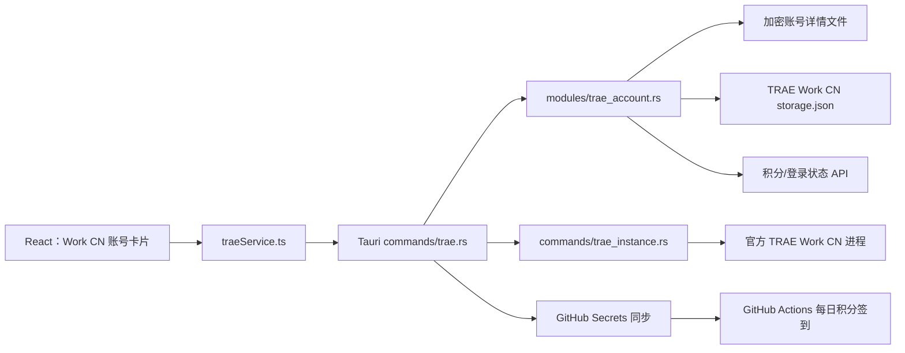

# TRAE Work CN 四账号一键切换器——GLM-5.2 完整开发文档

> **目标读者：** 使用 GLM-5.2 作为主要编码模型的开发者。本文按“模型对仓库几乎不了解、容易误改文件、容易重写已有逻辑”的情况编写。
>
> **开发原则：** 基于 Cockpit Tools v1.3.16 的既有 TRAE 账号管理和切号实现进行最小改造；不要重新发明认证、注入和启动逻辑。
>
> **最终产品定位：** Windows 专用的 TRAE Work CN 四账号管理器。每个账号首次正常登录一次，以后在本软件里点击“切换并打开”，官方 TRAE Work CN 自动切换到目标账号，不再重复输入密码或扫码。积分签到继续由现有 GitHub Actions 完成；本软件只展示积分余额、维护登录快照，并把最新签到凭证同步给 GitHub。

---

## 0. 给 GLM-5.2 的最高优先级指令

把下面规则放在每一次开发对话的最前面。任何一条未满足，都不能继续下一阶段。

1. **开发基线固定为 Cockpit Tools `v1.3.16` 标签，标签对象 `e0c0292ff08476b7b02a4be4a46a9f5284a223d9`，标签指向的源码提交 `e1ef55ce9f158dd1ee9fd682cf8d9aa1b79601e8`。** 不要直接基于不断变化的 `main` 分支开发。
2. **先完整复制并成功构建原项目，再修改。** 原项目未成功运行前，禁止裁剪代码。
3. **桌面应用实际编译的 TRAE 核心位于 `src-tauri/src/modules/trae_account.rs`。** `crates/cockpit-core/src/modules/trae_account.rs` 主要供独立 CLI crate 使用；只修改后者不会改变桌面程序行为。
4. **继续使用内部平台标识 `trae_solo_cn` 和 Rust 枚举 `TraePlatformKind::TraeSoloCn`。** 不要新增 `trae_work_cn` 平台枚举，不要复制一整套新模块。
5. 用户可见文字统一显示 **“TRAE Work CN”**；内部兼容旧名称 **“TRAE SOLO CN”**。
6. **切号必须复用上游调用链：** 本机导入 → 保存账号 → `inject_trae_account`/专用包装命令 → 默认实例绑定 → `trae_start_instance`。
7. 禁止只保存 access token。一个可长期免登录切换的账号必须保存：refresh token、账号 UID、认证原始数据、数字 DeviceID、设备公私钥、usertag、服务端信息以及必要的本机标识。
8. 切换前必须先把当前客户端最新登录态同步回账号库，避免丢失由官方客户端轮换后的 refresh token。
9. 注入前必须关闭 TRAE Work CN；写入 `storage.json` 必须继续使用上游原子写入模块。
10. 任一切换步骤失败必须回滚原始 `storage.json` 和原账号绑定，不允许把用户留在空白登录态。
11. 本软件**禁止执行本地积分签到 claim**。签到仍由 GitHub Actions 执行；本软件只能查询积分、同步签到凭证。
12. 任何日志、弹窗、测试输出都不能显示完整 access token、refresh token、私钥或 GitHub 凭证。
13. 每个任务都必须遵循：先写/补测试 → 运行并确认失败 → 最小实现 → 运行测试通过 → 再提交。
14. 第一版不要大规模删除上游后端模块。先把 UI 收敛到 Work CN，待完整验收后再做物理裁剪。
15. 如果代码行为与本文冲突，优先停下来检查上游实现，不要猜测。

---

# 一、产品需求

## 1.1 用户真正需要的体验

用户有 4 个 TRAE Work CN 积分制账号。

首次配置时，每个账号允许正常登录一次：

```text
打开 TRAE Work CN → 输入密码/扫码 → 登录成功 → 在管理器中导入当前账号
```

账号保存完成后，日常切换必须变成：

```text
点击账号卡片上的“切换并打开”
→ 管理器保存当前账号最新会话
→ 正常关闭当前 TRAE Work CN
→ 注入目标账号完整登录快照
→ 启动官方 TRAE Work CN
→ 校验打开后的 UID 是目标账号
→ 完成
```

正常情况下，不再要求用户：

- 再次输入账号密码；
- 再次扫码；
- 手动退出账号；
- 手动复制 JWT；
- 手动编辑 `storage.json`；
- 手动运行 Python 解密脚本。

只有以下外部情况允许提示重新登录：

- TRAE 服务端主动吊销 refresh token；
- 用户修改密码或主动退出所有设备；
- 服务端要求安全验证；
- 本机账号快照或设备私钥损坏；
- 账号长时间没有成功刷新并超过 refresh token 有效期。

## 1.2 主界面

主界面只保留一个主要页面：**账号切换**。

每个账号使用一张卡片，至少显示：

```text
账号备注：1780293
账号 UID：1493603882371939
状态：当前账号 / 可切换 / 需要重新登录
剩余积分：750
已用积分：250 / 1000
Token：剩余 12 天
GitHub：已同步 / 待同步 / 未配置
操作：[切换并打开] [刷新积分] [更多]
```

如果积分总量为 `-1`，显示：

```text
剩余积分：无限
```

绝对不能显示“美元余额”“USD”“快请求额度”作为 Work CN 主指标。Work CN 主指标是：

- 总积分；
- 已用积分；
- 剩余积分。

## 1.3 必须提供的功能

### P0：必须完成

- 自动识别本机 TRAE Work CN 安装；
- 兼容旧 `TRAE SOLO CN` 安装路径和数据目录；
- 从当前官方客户端导入已登录账号；
- 最多管理 4 个账号；
- 修改账号备注；
- 一键切换并打开官方客户端；
- 切换前保存当前账号最新 Token；
- 切换失败自动回滚；
- 显示当前账号；
- 显示 JWT 到期时间；
- 查询并显示积分余额；
- 账号详情文件加密保存；
- 提供诊断日志，且敏感数据脱敏。

### P1：为 GitHub 签到闭环需要完成

- 4 个账号分别绑定 `TRAE1`～`TRAE4` 槽位；
- 将 access token 和 `telemetry.devDeviceId` 同步到对应 GitHub Secrets；
- 账号 Token 变化时自动同步；
- GitHub 同步失败不能阻止本地切号；
- 显示最后同步时间和错误原因；
- 本地不执行签到，只同步凭证。

### 明确不做

- 不支持 Trae、Trae CN、国际版 TRAE SOLO；
- 不支持同时多开 4 个 Work CN；
- 不在本软件执行积分 claim；
- 不修改 TRAE Work CN 客户端二进制；
- 不绕过服务端安全验证；
- 不把 Token 提交到 Git；
- 不把完整 Cockpit Tools 的 Codex、Cursor、Kiro 等功能带到最终 UI；
- 第一版不做跨平台，只保证 Windows 11。

---

# 二、已经核实的环境事实

本文编写日期为 **2026 年 8 月 12 日**。当前目标电脑实际环境：

```text
Windows 卸载注册表显示名：TraeWork CN (User)
客户端版本：0.1.48
实际安装目录：D:\联想软件下载内容\TRAE SOLO CN\
实际 EXE：D:\联想软件下载内容\TRAE SOLO CN\TRAE SOLO CN.exe
实际用户数据目录：%APPDATA%\TRAE SOLO CN
开始菜单/桌面显示名：TRAE Work CN
内部 applicationName：trae-solo-cn
```

这说明：

- TRAE Work CN 是当前用户可见的新名称；
- 安装目录、EXE 名、AppData 目录和内部标识仍可能保留旧名；
- 新工具必须把它作为**同一平台的名称迁移**处理，而不是两套完全不同的软件。

上游 v1.3.16 已有部分兼容：

```rust
TraePlatformKind::TraeSoloCn => &["TRAE SOLO CN", "TRAE Work CN"]
```

但目标电脑注册表实际是 `TraeWork CN (User)`，中间没有空格，所以还需要补充别名。

---

# 三、上游项目与许可要求

## 3.1 固定上游

上游仓库：

```text
https://github.com/jlcodes99/cockpit-tools
```

固定版本：

```text
Tag: v1.3.16
Annotated tag object: e0c0292ff08476b7b02a4be4a46a9f5284a223d9
Source commit (`v1.3.16^{}`): e1ef55ce9f158dd1ee9fd682cf8d9aa1b79601e8
```

不要根据本文重新从零创建 Tauri 项目。应先克隆上游：

```powershell
git clone https://github.com/jlcodes99/cockpit-tools.git trae-work-cn-switcher
cd trae-work-cn-switcher
git checkout v1.3.16
git switch -c codex/trae-work-cn-switcher
```

然后确认：

```powershell
git rev-parse HEAD
```

输出必须是：

```text
e1ef55ce9f158dd1ee9fd682cf8d9aa1b79601e8
```

## 3.2 许可和署名

上游 Rust crates 声明许可证为：

```text
CC-BY-NC-SA-4.0
```

用户已说明取得作者授权，但仍应：

- 保留原作者 `jlcodes` 署名；
- 在项目根目录新增 `NOTICE.md`；
- 写明本项目基于 Cockpit Tools v1.3.16 修改；
- 写明上游仓库和固定提交；
- 保留上游许可证声明；
- 若将来公开或分发，按作者授权和许可证约束处理；
- 不要删除上游版权信息。

建议 `NOTICE.md` 内容：

```markdown
# Notice

This project is a specialized derivative of Cockpit Tools v1.3.16.
Original project: https://github.com/jlcodes99/cockpit-tools
Original author: jlcodes
Base source commit: e1ef55ce9f158dd1ee9fd682cf8d9aa1b79601e8
Annotated tag object: e0c0292ff08476b7b02a4be4a46a9f5284a223d9

This derivative focuses on local TRAE Work CN account switching and keeps
attribution to the original project. Additional permission from the original
author should be retained by the project owner.
```

---

# 四、技术栈与构建环境

## 4.1 延用上游技术栈

不要换技术栈：

- Tauri 2；
- Rust；
- React 19；
- TypeScript；
- Vite 7；
- Zustand；
- Tailwind CSS / DaisyUI；
- Windows WebView2；
- reqwest；
- serde / serde_json；
- AES-256-GCM 账号文件加密；
- 上游 atomic write 原子写文件实现。

## 4.2 Windows 开发前置环境

至少安装：

- Git；
- Node.js 18 或更高版本；
- npm 9 或更高版本；
- Rust stable，包含 MSVC target；
- Visual Studio 2022 Build Tools；
- “Desktop development with C++”；
- Windows 10/11 SDK；
- Microsoft Edge WebView2 Runtime；
- 可选：GitHub CLI `gh`，用于安全同步 GitHub Secrets。

检查命令：

```powershell
git --version
node --version
npm --version
rustc --version
cargo --version
where.exe cl
where.exe gh
```

## 4.3 原版首次构建

在没有修改任何代码之前：

```powershell
npm install
npm run typecheck
cargo test -p cockpit-tools
npm run tauri dev
```

注意：桌面 crate 名称是 `cockpit-tools`。如果 `cargo test -p cockpit-tools` 不适用，先运行：

```powershell
cargo metadata --no-deps --format-version 1
```

确认实际 package 名后再运行测试。

必须人工确认原版 Cockpit Tools 窗口能够打开。原版都打不开时，禁止开始裁剪。

构建安装包：

```powershell
npm run tauri build
```

Windows 构建产物通常位于：

```text
target\release\bundle\msi\
target\release\bundle\nsis\
```

---

# 五、仓库结构：GLM-5.2 必须先理解

## 5.1 桌面程序实际使用的代码

桌面 Tauri 程序直接声明：

```rust
mod commands;
mod models;
mod modules;
```

所以桌面运行时主要修改以下文件：

```text
src-tauri/src/modules/trae_account.rs
src-tauri/src/modules/trae_instance.rs
src-tauri/src/modules/trae_oauth.rs
src-tauri/src/modules/process.rs
src-tauri/src/commands/trae.rs
src-tauri/src/commands/trae_instance.rs
src-tauri/src/models/trae.rs
src-tauri/src/lib.rs
```

前端主要文件：

```text
src/App.tsx
src/services/traeService.ts
src/stores/useTraeAccountStore.ts
src/types/trae.ts
src/pages/TraeAccountsPage.tsx
src/components/layout/SideNav.tsx
src/utils/platformMeta.tsx
```

## 5.2 容易误改的重复代码

仓库还有：

```text
crates/cockpit-core/src/modules/trae_account.rs
crates/cockpit-core/src/models/trae.rs
```

`crates/cockpit-core` 主要由 `crates/cockpit-cli` 使用，并不是桌面 Tauri 主程序的直接模块来源。

因此：

- 修复桌面切号行为，必须改 `src-tauri/src/modules/trae_account.rs`；
- 只改 `crates/cockpit-core` 会出现“测试可能过了，但桌面没有变化”的假象；
- 第一版可以暂时不维护 CLI；
- 若后续保留 CLI，再把稳定后的公共逻辑同步过去；
- 不要在第一阶段尝试合并两套模块，避免扩大风险。

---

## 5.3 专用版数据目录必须与 Cockpit Tools 隔离

上游默认把数据放在：

```text
~/.antigravity_cockpit
~/.antigravity_cockpit_dev
```

专用版如果继续使用该目录，会与用户安装的原 Cockpit Tools 共用账号索引、加密密钥和配置，这是禁止的。

在 `src-tauri/src/modules/account.rs` 中修改：

```rust
const DATA_DIR: &str = ".trae_work_cn_switcher";
const DEV_DATA_DIR: &str = ".trae_work_cn_switcher_dev";
const DATA_DIR_ENV: &str = "TRAE_WORK_CN_SWITCHER_DATA_DIR";
const PROFILE_ENV: &str = "TRAE_WORK_CN_SWITCHER_PROFILE";
```

测试环境变量同步改为优先读取：

```text
TRAE_WORK_CN_SWITCHER_TEST_DATA_DIR
TRAE_WORK_CN_SWITCHER_DATA_DIR
```

为了保留上游测试便利，可在测试模式临时兼容旧变量，但正式运行不能默认读取 `.antigravity_cockpit`。

专用版数据目录预计为：

```text
%USERPROFILE%\.trae_work_cn_switcher
```

其中保存：

```text
trae_accounts.json             # 非敏感索引
trae_accounts\<id>.json       # AES-256-GCM 加密账号详情
secure-account-storage.key     # 本机加密密钥
github.json                    # 仓库和槽位名，不含 GitHub Token
logs\                          # 脱敏日志
```

如果将来需要从 Cockpit Tools 导入已有 TRAE 账号，必须提供显式的“一次性迁移”操作，不允许启动时静默读取或修改原 Cockpit Tools 数据。

---
# 六、TRAE Work CN 登录数据模型

## 6.1 官方本地存储

当前主要文件：

```text
%APPDATA%\TRAE SOLO CN\User\globalStorage\storage.json
```

未来可能出现：

```text
%APPDATA%\TRAE Work CN\User\globalStorage\storage.json
%APPDATA%\TraeWork CN\User\globalStorage\storage.json
```

核心键：

```text
iCubeAuthInfo://icube.cloudide
iCubeAuthInfo://icube-dc:<数字DeviceID>
iCubeAuthInfo://usertag
iCubeServerData://icube.cloudide
iCubeEntitlementInfo://icube.cloudide
telemetry.devDeviceId
telemetry.machineId
```

## 6.2 两种 Device ID 不能混淆

### A. 数字 DeviceID

示例：

```text
1132918838145530
```

对应存储键：

```text
iCubeAuthInfo://icube-dc:1132918838145530
```

它对应设备公私钥，用于官方登录态刷新、DeviceProof 签名和免登录切号。

### B. `telemetry.devDeviceId`

示例格式：

```text
d6b8ac2e-f4d1-496d-a9a6-c9c7b4bd23e3
```

这是 UUID，GitHub 积分签到请求头 `x-device-id` 使用它。

规则：

- 数字 DeviceID 和 UUID 不是同一个值；
- 数字 DeviceID 用于客户端认证设备密钥；
- UUID 用于当前积分签到 API；
- 不允许互相替代；
- 当前同一台电脑上的多个账号可能共用同一个 `telemetry.devDeviceId`，这不表示账号导入错误。

## 6.3 保存一个账号必须包含什么

上游 `TraeAccount` 已保存：

- `access_token`；
- `refresh_token`；
- `expires_at`；
- `user_id`；
- `trae_auth_raw`；
- `trae_profile_raw`；
- `trae_entitlement_raw`；
- `trae_usage_raw`；
- `trae_server_raw`；
- `trae_usertag_raw`。

专用版应在模型中增加清晰字段：

```rust
#[serde(default, skip_serializing_if = "Option::is_none")]
pub checkin_device_id: Option<String>, // telemetry.devDeviceId UUID

#[serde(default, skip_serializing_if = "Option::is_none")]
pub machine_id: Option<String>, // telemetry.machineId

#[serde(default, skip_serializing_if = "Option::is_none")]
pub auth_device_id: Option<String>, // icube-dc 后缀，数字 ID
```

设备公私钥不要再复制成独立顶层字段，继续放在加密账号详情中的：

```json
{
  "trae_auth_raw": {
    "deviceInfo": {
      "DeviceID": "1132918838145530"
    },
    "deviceKeyPair": {
      "privateKeyPEM": "...",
      "publicKeyPEM": "..."
    }
  }
}
```

账号详情文件已经通过上游 `secure_account_storage` 使用 AES-256-GCM 加密。必须继续复用：

```rust
secure_account_storage::serialize_account_file("trae", account)
secure_account_storage::deserialize_account_file(...)
```

禁止退回明文 JSON。

---

# 七、总体架构



## 7.1 模块职责

### `trae_account.rs`

负责：

- 读取/解密官方 `storage.json`；
- 将当前本地账号转成 `TraeAccount`；
- 捕获设备密钥；
- 保存账号加密详情；
- 将目标账号注入 `storage.json`；
- 查询/刷新登录态；
- 查询积分使用数据；
- 校验账号快照是否完整。

### `commands/trae.rs`

负责：

- 暴露 Tauri 命令；
- 编排“保存当前账号 → 关闭 → 注入 → 启动 → 验证 → 回滚”；
- 触发 GitHub 同步；
- 返回适合 UI 展示的结构化结果。

### `commands/trae_instance.rs`

负责：

- 默认实例启动和关闭；
- 绑定目标账号；
- 调用现有注入逻辑；
- 启动后验证。

### `workCnGitHubSync.rs` / Rust GitHub 模块

负责：

- 保存仓库和 4 个槽位映射；
- 调用 GitHub CLI 更新 secrets；
- 不负责签到；
- 失败仅记录，不影响本地切号。

### React 页面

负责：

- 展示 4 张账号卡；
- 添加/导入账号；
- 切换账号；
- 展示积分、Token、GitHub 状态；
- 不接触设备私钥；
- 不自行改 `storage.json`。

---

# 八、核心业务流程

## 8.1 首次添加账号

推荐主流程是“从官方客户端导入”，不是让新软件伪造网页登录。

```text
1. 用户点击“添加账号”
2. 软件检查 TRAE Work CN 是否已安装
3. 用户点击“打开 Work CN 登录”
4. 软件启动官方 Work CN
5. 用户在官方客户端完成正常登录
6. 用户回到管理器点击“我已登录，导入当前账号”
7. 管理器读取 storage.json
8. 解密用户认证信息和设备密钥
9. 验证 access token、refresh token、UID、设备密钥完整
10. 加密保存为账号详情
11. 查询积分并显示账号卡
```

如果导入时已有同一 UID：

- 更新原账号，不新增重复记录；
- 保留用户设置的备注和 GitHub 槽位；
- 用本地更近的新 Token 覆盖旧 Token；
- 更新设备密钥和本机标识。

## 8.2 导入时必须补齐设备密钥

上游 v1.3.16 的 `payload_from_storage_root` 主要读取用户认证、server、entitlement 和 usertag。专用版必须明确读取：

```text
iCubeAuthInfo://icube-dc:<数字ID>
```

算法：

1. 遍历 `storage.json` 所有键；
2. 找到以 `iCubeAuthInfo://icube-dc:` 开头的键；
3. 取后缀作为 `auth_device_id`；
4. 使用上游 `parse_value_or_json_string_or_icube_cipher` 解密值；
5. 验证存在 `privateKeyPEM` 和 `publicKeyPEM`；
6. 将它们写入 `trae_auth_raw.deviceKeyPair`；
7. 将数字 ID 写入 `trae_auth_raw.deviceInfo.DeviceID`；
8. 从根对象读取 `telemetry.devDeviceId` 和 `telemetry.machineId`；
9. 返回补齐后的 `TraeImportPayload`。

建议新增内部结构：

```rust
struct LocalWorkCnDeviceSnapshot {
    auth_device_id: Option<String>,
    checkin_device_id: Option<String>,
    machine_id: Option<String>,
    device_key_pair: Option<serde_json::Value>,
}
```

建议新增函数：

```rust
fn extract_local_work_cn_device_snapshot(
    storage_root: &serde_json::Value,
) -> LocalWorkCnDeviceSnapshot
```

然后由：

```rust
fn payload_from_storage_root(...)
```

合并到 `TraeImportPayload`。

## 8.3 一键切换状态机

不要让前端连续调用多个低层命令。增加一个专用、原子的 Tauri 命令：

```rust
#[tauri::command]
pub async fn switch_work_cn_account(
    app: tauri::AppHandle,
    account_id: String,
) -> Result<WorkCnSwitchResult, String>
```

返回：

```rust
#[derive(Serialize)]
#[serde(rename_all = "camelCase")]
pub struct WorkCnSwitchResult {
    pub account_id: String,
    pub user_id: Option<String>,
    pub launched: bool,
    pub verified: bool,
    pub github_synced: bool,
    pub warning: Option<String>,
}
```

严格步骤：

### 步骤 1：获取全局切号锁

同一时间只能执行一次切换：

```rust
static WORK_CN_SWITCH_LOCK: OnceLock<tokio::sync::Mutex<()>> = OnceLock::new();
```

若用户重复点击，前端按钮进入 loading，不再发起第二个请求。

### 步骤 2：校验目标账号

新增：

```rust
pub fn validate_work_cn_account_for_switch(account: &TraeAccount) -> Result<(), String>
```

至少验证：

- 账号存在；
- 平台为 `TraeSoloCn`；
- access token 非空；
- refresh token 非空，否则提示该账号只能短期切换；
- user ID 非空；
- `trae_auth_raw` 存在；
- `deviceInfo.DeviceID` 存在；
- `deviceKeyPair.privateKeyPEM` 存在；
- `deviceKeyPair.publicKeyPEM` 存在；
- `checkin_device_id` 存在时格式为非空 UUID 风格字符串。

P0 版本应把缺少设备密钥视为错误，避免切换后 14 天即失效。

### 步骤 3：保存当前官方客户端会话

这是防止 refresh token 轮换丢失的关键步骤。

在关闭当前客户端前调用：

```rust
pub fn sync_current_work_cn_session_from_local() -> Result<Option<TraeAccount>, String>
```

逻辑：

1. 读取当前实际 `storage.json`；
2. 解析 UID；
3. 与账号库匹配；
4. 使用 `upsert_account` 更新当前账号；
5. 如果 access token 或 refresh token 发生变化，记录 `token_changed=true`；
6. 若启用 GitHub，同步当前账号最新凭证；
7. 当前本地账号不在账号库时，不应阻止切换，但要提示用户是否先导入。

### 步骤 4：保存回滚快照

在关闭进程后、写入目标账号前：

- 原样读取 `storage.json` 字节；
- 保存原默认实例绑定账号 ID；
- 保存原当前账号 ID；
- 保存客户端切换前是否正在运行；
- 回滚快照只在内存中保留，或写入应用临时目录；
- 临时文件不允许进入 Git。

结构建议：

```rust
struct WorkCnRollbackSnapshot {
    storage_path: PathBuf,
    storage_bytes: Option<Vec<u8>>,
    previous_account_id: Option<String>,
    previous_bind_account_id: Option<String>,
    was_running: bool,
}
```

### 步骤 5：正常关闭官方客户端

复用上游：

```rust
process::close_trae_platform_default("trae_solo_cn", 20)
```

不应一开始直接 `taskkill /F`。正常关闭失败时：

- 中止切号；
- 不写 `storage.json`；
- UI 提示用户先保存工作并关闭；
- 可提供“强制关闭后重试”二次操作，但不能默认强杀。

### 步骤 6：注入目标账号

复用：

```rust
trae_account::inject_to_trae_for_platform(
    TraePlatformKind::TraeSoloCn,
    &account_id,
)
```

注入必须继续完成：

- 用户认证密文；
- refresh token；
- server data；
- entitlement data；
- usertag；
- 数字 DeviceID 对应的设备密钥。

写文件继续使用上游：

```rust
atomic_write::write_string_atomic
```

### 步骤 7：绑定并启动默认实例

复用上游默认实例：

```rust
trae_instance::update_default_settings_for_platform(
    TraePlatformKind::TraeSoloCn,
    Some(Some(account_id.clone())),
    None,
    Some(false),
)
```

然后复用：

```rust
commands::trae_instance::trae_start_instance(
    Some("trae_solo_cn".to_string()),
    "__default__".to_string(),
).await
```

不要自己拼接 `Command::new(exe)`，除非是在修复上游路径发现逻辑。

### 步骤 8：启动后验证

启动后最多等待 30 秒，每 1 秒检查：

- Work CN 进程存在；
- `storage.json` 可以读取；
- 当前解析出的 UID 等于目标账号 UID；
- access token 非空；
- 没有立刻被客户端清空登录态。

验证函数：

```rust
async fn verify_work_cn_switched_account(
    expected_account: &TraeAccount,
    timeout: Duration,
) -> Result<(), String>
```

验证成功后：

- 再读取一次本地 storage；
- 若官方客户端启动后刷新了 Token，更新账号库；
- 再执行 GitHub 同步；
- 返回 `verified=true`。

### 步骤 9：失败回滚

以下任一步失败都进入回滚：

- 注入失败；
- 启动失败；
- UID 验证失败；
- storage 被清空；
- 目标账号被官方客户端判为未登录。

回滚步骤：

```text
关闭失败启动的 Work CN
→ 原样恢复旧 storage.json 字节
→ 恢复 previous_bind_account_id
→ 恢复 current account state
→ 如果切换前正在运行，则重新启动旧账号
→ 返回明确错误
```

回滚失败时必须把两个错误都写入日志：

```text
主错误：启动后 UID 不匹配
回滚错误：恢复 storage.json 失败
```

## 8.4 积分查询

本软件只查询，不签到。

复用上游对：

```text
/trae/api/v2/pay/ide_user_ent_usage
```

的调用和 `trae_usage_raw` 缓存。

新增类型：

```rust
#[derive(Debug, Clone, Serialize)]
#[serde(rename_all = "camelCase")]
pub struct WorkCnCreditsSummary {
    pub total: Option<i64>,
    pub used: i64,
    pub remaining: Option<i64>,
    pub unlimited: bool,
    pub updated_at: i64,
}
```

解析规则：

1. 读取 `user_entitlement_pack_list`；
2. 忽略隐藏包 `is_hide=true`；
3. 忽略明确非激活状态的包；
4. 对每个包读取：
   - `entitlement_base_info.quota.credits_limit`；
   - `usage.credits_amount`；
5. `credits_limit == -1` 表示无限；
6. 有任一无限包时：`unlimited=true`，`total=None`，`remaining=None`；
7. 否则总积分为所有有效包 `credits_limit` 之和；
8. 已用积分为所有有效包 `credits_amount` 之和；
9. 剩余积分 `max(total-used, 0)`；
10. 找不到 `credits_limit` 时返回“暂无积分数据”，不能误显示 0。

新增命令：

```rust
#[tauri::command]
pub async fn get_work_cn_credits(
    account_id: String,
    force_refresh: bool,
) -> Result<WorkCnCreditsSummary, String>
```

`force_refresh=true` 时调用上游 `refresh_account_usage_only_async`，但绝不调用：

```text
/trae/api/v2/ug/checkin_credits/claim
```

## 8.5 GitHub Secrets 同步

### 为什么仍需要同步

GitHub Actions 使用 14 天左右有效的 JWT 执行积分签到。官方 Work CN 可能在本机轮换 JWT，因此本软件需要把最新 JWT 同步给 GitHub，但**不在本机签到**。

### 推荐实现：GitHub CLI

第一版不要在应用里自己实现 GitHub PAT、public key 和 libsodium 加密。优先调用已登录的 GitHub CLI：

```powershell
gh auth login
gh auth status
```

应用配置只保存：

```json
{
  "enabled": true,
  "repository": "lk1015646426/daily-checkin",
  "slots": [
    {
      "slot": 1,
      "accountId": "...",
      "tokenSecret": "TRAE1_TOKEN",
      "deviceSecret": "TRAE1_DEVICE_ID"
    }
  ]
}
```

不要保存 GitHub 密码。`gh` 的认证由 GitHub CLI 自己管理。

Rust 调用时，secret 值通过 stdin 传入，禁止放在命令行参数里：

```text
gh secret set TRAE1_TOKEN --repo lk1015646426/daily-checkin
```

然后把 token 写入子进程 stdin。

新增模块：

```text
src-tauri/src/modules/work_cn_github.rs
src-tauri/src/commands/work_cn_github.rs
```

接口建议：

```rust
pub fn github_cli_available() -> bool;
pub fn github_auth_status() -> Result<(), String>;
pub fn sync_account_secrets(
    account: &TraeAccount,
    slot: &WorkCnGitHubSlot,
    repository: &str,
) -> Result<(), String>;
```

必须同步：

```text
TRAE{N}_TOKEN     = account.access_token
TRAE{N}_DEVICE_ID = account.checkin_device_id
```

同步触发时机：

- 新账号导入成功；
- 切换前捕获当前账号且 Token 发生变化；
- 切换后发现目标账号 Token 发生变化；
- 用户点击“同步 GitHub”；
- 后台监控发现当前官方客户端 Token 变化。

GitHub 同步失败：

- 不回滚本地切号；
- 账号卡标记“GitHub 待同步”；
- 保存错误摘要；
- 提供重试按钮；
- 日志不能输出 Token。

## 8.6 登录态后台监测

为了避免官方客户端在运行期间刷新 Token，而 GitHub 仍使用旧 Token，应用应支持最小监测：

- 应用可最小化到托盘；
- 每 60 秒检查一次当前 `storage.json` 修改时间；
- 只有文件变化且 Work CN 正在运行时才解析；
- 识别当前 UID；
- 更新对应账号快照；
- access token 变化时同步 GitHub；
- 不触发本地签到；
- 不频繁调用刷新 API。

建议模块：

```text
src-tauri/src/modules/work_cn_session_watcher.rs
```

状态锁必须避免与切号命令同时写账号文件。

---

# 九、TRAE Work CN 路径兼容

## 9.1 注册表显示名

修改桌面实际文件：

```text
src-tauri/src/modules/trae_account.rs
```

将 `TraeSoloCn` 的别名扩展为：

```rust
TraePlatformKind::TraeSoloCn => &[
    "TRAE SOLO CN",
    "TRAE Work CN",
    "TraeWork CN",
]
```

现有标准化函数会去除 `(User)`，因此应覆盖：

```text
TRAE SOLO CN
TRAE SOLO CN (User)
TRAE Work CN
TRAE Work CN (User)
TraeWork CN
TraeWork CN (User)
```

## 9.2 EXE 候选名

扩展：

```rust
TraePlatformKind::TraeSoloCn => &[
    "TRAE Work CN.exe",
    "TraeWork CN.exe",
    "TRAE SOLO CN.exe",
    "Trae.exe",
    "Electron.exe",
]
```

顺序上新名称在前，旧名称作为兼容。

## 9.3 用户数据目录候选

不要直接把 `app_support_dir_name()` 改为 `TRAE Work CN`，否则会丢失当前真实数据。

新增：

```rust
pub fn get_trae_data_dir_candidates_for_platform(
    platform: TraePlatformKind,
) -> Result<Vec<PathBuf>, String>
```

`TraeSoloCn` 在 Windows 返回：

```text
%APPDATA%\TRAE SOLO CN
%APPDATA%\TRAE Work CN
%APPDATA%\TraeWork CN
```

选择规则：

1. 用户设置的显式路径优先；
2. 存在 `User\globalStorage\storage.json` 且包含有效登录信息的目录优先；
3. 多个目录都有效时，优先最近修改的 `storage.json`；
4. 若只有旧目录存在，继续使用旧目录；
5. 不要自动搬迁整个用户目录；
6. UI 设置页允许用户手动指定路径。

对目标电脑，必须最终选中：

```text
C:\Users\10156\AppData\Roaming\TRAE SOLO CN
```

## 9.4 产品显示名称

内部：

```text
trae_solo_cn
TraePlatformKind::TraeSoloCn
```

用户界面：

```text
TRAE Work CN
```

这是同一平台的兼容别名，不建立新枚举。

---

# 十、前端设计

## 10.1 不要直接破坏巨型通用页面

上游 `TraeAccountsPage.tsx` 体积较大，包含多个 Trae 平台和通用能力。GLM-5.2 不应在第一步删除其中大量分支。

推荐新建轻量页面：

```text
src/pages/WorkCnSwitcherPage.tsx
src/components/work-cn/WorkCnAccountCard.tsx
src/components/work-cn/WorkCnAddAccountDialog.tsx
src/components/work-cn/WorkCnSettingsDialog.tsx
src/components/work-cn/WorkCnStatusBanner.tsx
src/services/workCnService.ts
src/stores/useWorkCnStore.ts
src/types/workCn.ts
```

这些文件调用现有 `traeService` 和新增的专用命令。

## 10.2 页面布局

```text
┌──────────────────────────────────────────────────────────────┐
│ TRAE Work CN 账号切换器                         [设置] [日志] │
│ 当前客户端：0.1.48  已安装  当前账号：1780293                │
├──────────────────────────────────────────────────────────────┤
│ [账号卡1]  [账号卡2]                                         │
│ [账号卡3]  [账号卡4/添加账号]                                │
├──────────────────────────────────────────────────────────────┤
│ GitHub 签到：已连接 | 最近凭证同步：14:16                    │
└──────────────────────────────────────────────────────────────┘
```

桌面最小尺寸建议：

```text
宽 880，高 620
```

不需要原项目 1280×800 的复杂仪表盘。

## 10.3 账号卡状态

状态枚举：

```ts
export type WorkCnAccountStatus =
  | 'current'
  | 'ready'
  | 'switching'
  | 'needs_login'
  | 'invalid_snapshot'
  | 'github_pending';
```

按钮规则：

- 当前账号：显示“打开 Work CN”，不重复注入；
- 非当前账号：显示“切换并打开”；
- `switching`：全部卡片禁用；
- 缺少设备密钥：显示“重新登录并导入”；
- GitHub 错误：仍允许本地切号；
- 已满 4 个账号：隐藏“添加账号”主按钮，改为“替换/删除”。

## 10.4 添加账号向导

对 GLM-5.2，按三步弹窗实现，不要做复杂状态机动画。

### 第一步

```text
请先在官方 TRAE Work CN 中登录需要添加的账号。
[打开 TRAE Work CN]
```

### 第二步

```text
登录成功后回到这里。
[我已登录，读取当前账号]
```

### 第三步

显示识别结果：

```text
UID：1493603882371939
备注：[1780293]
Token：有效
设备密钥：完整
签到设备 ID：已识别
[保存账号]
```

若设备密钥不完整，不允许保存为“可免登录切换”账号。

## 10.5 积分显示

显示顺序：

1. 剩余积分（最大字号）；
2. 已用 / 总积分；
3. 数据更新时间；
4. 刷新按钮。

不显示本地签到按钮。

---

# 十一、文件修改总表

## 11.1 必须修改

```text
package.json
src-tauri/tauri.conf.json
src-tauri/tauri.dev.conf.json
src-tauri/Cargo.toml
src-tauri/src/lib.rs
src-tauri/src/modules/account.rs
src-tauri/src/models/trae.rs
src-tauri/src/modules/mod.rs
src-tauri/src/modules/trae_account.rs
src-tauri/src/modules/trae_instance.rs
src-tauri/src/modules/process.rs
src-tauri/src/commands/mod.rs
src-tauri/src/commands/trae.rs
src-tauri/src/commands/trae_instance.rs
src/App.tsx
src/types/trae.ts
src/services/traeService.ts
```

## 11.2 建议新增

```text
NOTICE.md
README.md
src-tauri/src/models/work_cn.rs
src-tauri/src/modules/work_cn_github.rs
src-tauri/src/modules/work_cn_session_watcher.rs
src-tauri/src/commands/work_cn.rs
src-tauri/src/commands/work_cn_github.rs
src/pages/WorkCnSwitcherPage.tsx
src/components/work-cn/WorkCnAccountCard.tsx
src/components/work-cn/WorkCnAddAccountDialog.tsx
src/components/work-cn/WorkCnSettingsDialog.tsx
src/components/work-cn/WorkCnStatusBanner.tsx
src/services/workCnService.ts
src/stores/useWorkCnStore.ts
src/types/workCn.ts
src/locales/zh-CN.work-cn.json
```

## 11.3 第一版不要删除

即使最终 UI 不再展示，第一轮也先保留：

```text
src-tauri/src/modules/trae_oauth.rs
src-tauri/src/modules/secure_account_storage.rs
src-tauri/src/modules/atomic_write.rs
src-tauri/src/modules/provider_current_state.rs
src-tauri/src/modules/trae_session_transfer.rs
src-tauri/src/commands/trae_instance.rs
原 Trae account store/service
```

这些模块可能被切号、账号存储或启动流程间接依赖。

---
# 十二、分阶段开发计划

> 不允许让 GLM-5.2 一次完成全部功能。每个阶段必须独立构建、测试和人工验收。前一阶段未通过，禁止开始后一阶段。

## 阶段 0：建立干净基线

### 目标

获得一份固定在 v1.3.16、可以正常构建和启动的代码副本。

### 操作

```powershell
git clone https://github.com/jlcodes99/cockpit-tools.git trae-work-cn-switcher
cd trae-work-cn-switcher
git checkout v1.3.16
git switch -c codex/trae-work-cn-switcher
npm install
npm run typecheck
cargo test -p cockpit-tools
npm run tauri dev
```

### 验收

- `git rev-parse HEAD` 对应 v1.3.16 基线；
- TypeScript 类型检查通过；
- Rust 测试通过；
- 原 Cockpit Tools 窗口正常打开；
- 原版 TRAE SOLO CN/Work CN 页面能找到当前客户端；
- 不修改任何业务代码。

### 提交

不需要提交依赖目录。仅创建开发分支后记录基线：

```powershell
git status --short
git tag work-cn-baseline-v1.3.16
```

---

## 阶段 1：品牌和应用壳收敛

### 目标

先把产品变成一个只显示 TRAE Work CN 的壳，但暂时保留上游后端模块。

### 修改文件

```text
package.json
src-tauri/Cargo.toml
src-tauri/tauri.conf.json
src-tauri/src/modules/account.rs
src-tauri/tauri.dev.conf.json
src/App.tsx
src/pages/WorkCnSwitcherPage.tsx
NOTICE.md
README.md
```

### 具体修改

1. `package.json`：
   - `name` 改为 `trae-work-cn-switcher`；
   - 版本从 `0.1.0` 开始；
   - 保留原依赖和 scripts，不要删除 Tauri 构建脚本。

2. `src-tauri/Cargo.toml`：
   - 第一版保留 Rust package name `cockpit-tools` 和 library crate 名，确保上游构建脚本与本文测试命令稳定；
   - 只修改 description、产品显示名和 Tauri identifier；
   - 如发布前确实要改 Rust package name，放到阶段 8 单独处理并同步构建命令。
   - description 改为 Work CN 多账号切换器；
   - 保留作者和许可证信息，并追加派生项目作者。

3. `tauri.conf.json`：
   - `productName`: `TRAE Work CN 账号切换器`；
   - `identifier`: 使用新的唯一值，例如 `com.lk.trae-work-cn-switcher`；
   - 窗口标题统一改名；
   - 主窗口宽 960、高 680、最小宽 820、最小高 560；
   - 第一版关闭上游 updater，防止从 Cockpit Tools 更新源覆盖专用版；
   - 移除不再需要的 floating card 窗口配置，但只有在编译引用全部处理后再删。

4. `App.tsx`：
   - 只渲染 `WorkCnSwitcherPage`；
   - 不要立刻删除旧路由和页面文件；
   - 先通过不再引用的方式隐藏其他功能。

5. 新页面初始只显示静态框架：
   - 标题；
   - 客户端检测占位；
   - 4 个空账号槽位；
   - 设置按钮；
   - 日志按钮。

### 测试

```powershell
npm run typecheck
npm run build
cargo test -p cockpit-tools
npm run tauri dev
```

### 人工验收

- 窗口标题正确；
- 页面只看到 Work CN 内容；
- 无 Cockpit Tools 的其他平台入口；
- 开发者控制台无报错；
- 原 TRAE 后端命令仍然存在。

### 提交

```powershell
git add package.json src-tauri src NOTICE.md README.md
git commit -m "chore: specialize app shell for TRAE Work CN"
```

---

## 阶段 2：Work CN 路径和安装发现兼容

### 目标

稳定识别当前电脑以及未来可能改名后的 Work CN。

### 修改文件

```text
src-tauri/src/modules/trae_account.rs
src-tauri/src/modules/process.rs
src-tauri/src/modules/trae_instance.rs
src-tauri/src/commands/work_cn.rs
src-tauri/src/models/work_cn.rs
src-tauri/src/modules/mod.rs
src-tauri/src/commands/mod.rs
src-tauri/src/lib.rs
src/services/workCnService.ts
src/types/workCn.ts
```

### 新增命令

```rust
#[tauri::command]
pub fn get_work_cn_installation() -> Result<WorkCnInstallation, String>
```

结构：

```rust
#[derive(Debug, Clone, Serialize)]
#[serde(rename_all = "camelCase")]
pub struct WorkCnInstallation {
    pub installed: bool,
    pub executable_path: Option<String>,
    pub user_data_dir: Option<String>,
    pub storage_path: Option<String>,
    pub display_name: Option<String>,
    pub version: Option<String>,
    pub legacy_path: bool,
}
```

### 测试用例

在 `src-tauri/src/modules/trae_account.rs` 的测试模块补：

1. `TraeWork CN (User)` 能匹配 `TraeSoloCn`；
2. `TRAE Work CN (User)` 能匹配；
3. `TRAE SOLO CN` 能匹配；
4. `Trae CN` 不能误匹配；
5. EXE 候选包含新旧名称；
6. 多数据目录时选择包含有效 storage 且修改时间更新的目录；
7. 当前目标路径 `TRAE SOLO CN` 能被选中。

测试必须使用临时目录和环境变量覆盖，不访问真实用户文件。

### 运行

```powershell
cargo test -p cockpit-tools trae -- --nocapture
npm run typecheck
npm run tauri dev
```

### 人工验收

页面状态栏应显示类似：

```text
已检测到 TRAE Work CN 0.1.48
D:\联想软件下载内容\TRAE SOLO CN\TRAE SOLO CN.exe
兼容旧数据目录：%APPDATA%\TRAE SOLO CN
```

### 提交

```powershell
git commit -am "feat: detect TRAE Work CN legacy and renamed installations"
```

---

## 阶段 3：完整账号快照导入

### 目标

确保每个账号首次登录一次后，保存足够完整的认证环境，而不是只保存 JWT。

### 修改文件

```text
src-tauri/src/models/trae.rs
src-tauri/src/modules/trae_account.rs
src-tauri/src/commands/work_cn.rs
src-tauri/src/lib.rs
src/types/workCn.ts
src/services/workCnService.ts
src/stores/useWorkCnStore.ts
src/components/work-cn/WorkCnAddAccountDialog.tsx
```

### 后端新增字段

为 `TraeAccount` 和 `TraeImportPayload` 增加：

```rust
pub checkin_device_id: Option<String>,
pub machine_id: Option<String>,
pub auth_device_id: Option<String>,
```

所有字段加 `serde(default)` 以兼容旧账号文件。

### 后端新增函数

```rust
fn extract_local_work_cn_device_snapshot(
    storage_root: &Value,
) -> LocalWorkCnDeviceSnapshot;

fn merge_work_cn_device_snapshot_into_payload(
    payload: &mut TraeImportPayload,
    snapshot: LocalWorkCnDeviceSnapshot,
);

pub fn validate_work_cn_account_snapshot(
    account: &TraeAccount,
) -> WorkCnSnapshotValidation;
```

验证结果不要只返回布尔值：

```rust
#[derive(Debug, Clone, Serialize)]
#[serde(rename_all = "camelCase")]
pub struct WorkCnSnapshotValidation {
    pub valid_for_switch: bool,
    pub has_access_token: bool,
    pub has_refresh_token: bool,
    pub has_user_id: bool,
    pub has_auth_device_id: bool,
    pub has_device_private_key: bool,
    pub has_device_public_key: bool,
    pub has_checkin_device_id: bool,
    pub warnings: Vec<String>,
}
```

### 导入命令

```rust
#[tauri::command]
pub async fn import_current_work_cn_account(
    app: AppHandle,
    label: Option<String>,
) -> Result<WorkCnAccountView, String>
```

流程：

- 固定使用 `TraeSoloCn`；
- 从选择出的当前 storage 读取账号；
- 捕获数字 DeviceID 和密钥；
- 捕获 UUID 设备 ID；
- upsert 账号；
- 限制最多 4 个不同 UID；
- 同 UID 重复导入更新原记录；
- 账号备注另存为专用字段或标签，不能拿 email 强行覆盖；
- 返回脱敏视图。

### 关键测试

构造一个模拟 `storage.json`：

```json
{
  "iCubeAuthInfo://icube.cloudide": "<测试加密认证>",
  "iCubeAuthInfo://icube-dc:1132918838145530": "<测试加密设备密钥>",
  "telemetry.devDeviceId": "d6b8ac2e-f4d1-496d-a9a6-c9c7b4bd23e3",
  "telemetry.machineId": "machine-hash"
}
```

验证导入后：

- UID 正确；
- access token 正确但测试日志不输出；
- refresh token 存在；
- `auth_device_id` 正确；
- `checkin_device_id` 正确；
- `deviceKeyPair` 完整；
- 账号详情文件密文中搜不到 token 明文和私钥；
- 同 UID 第二次导入不会增加账号数量；
- 第 5 个不同账号返回明确错误。

### 人工验收

先用一个测试账号：

1. 在官方 Work CN 正常登录；
2. 点击“导入当前账号”；
3. 页面显示 UID 和快照完整；
4. 退出并重新打开管理器，账号仍在；
5. 查看管理器数据文件，不能看到明文 Token。

### 提交

```powershell
git commit -am "feat: import complete TRAE Work CN account snapshots"
```

---

## 阶段 4：安全的一键切换和回滚

### 目标

实现产品最核心的“点一下就换号”。

### 修改文件

```text
src-tauri/src/models/work_cn.rs
src-tauri/src/commands/work_cn.rs
src-tauri/src/commands/trae.rs
src-tauri/src/commands/trae_instance.rs
src-tauri/src/modules/trae_account.rs
src-tauri/src/modules/process.rs
src-tauri/src/lib.rs
src/services/workCnService.ts
src/stores/useWorkCnStore.ts
src/components/work-cn/WorkCnAccountCard.tsx
src/pages/WorkCnSwitcherPage.tsx
```

### 不允许的做法

- 前端依次调用“关闭、注入、启动”三个命令；
- 只写 access token；
- 切换前不保存当前账号；
- 写入失败后不回滚；
- 默认强杀 Work CN；
- 使用 Python 脚本作为核心切号实现；
- 新建第二套 Work CN 进程管理模块。

### 必须实现

专用命令：

```rust
switch_work_cn_account(account_id)
```

命令内部完成本文第 8.3 节的完整状态机。

### 错误码

不要让前端靠中文字符串判断。新增：

```rust
#[derive(Debug, Serialize)]
#[serde(rename_all = "SCREAMING_SNAKE_CASE")]
pub enum WorkCnErrorCode {
    AccountNotFound,
    SnapshotIncomplete,
    ClientNotInstalled,
    ClientCloseFailed,
    StorageBackupFailed,
    InjectFailed,
    LaunchFailed,
    VerifyTimeout,
    VerifyAccountMismatch,
    RollbackFailed,
    Busy,
}
```

Tauri 返回错误可序列化为 JSON 字符串，或者统一使用：

```rust
pub struct WorkCnCommandError {
    pub code: WorkCnErrorCode,
    pub message: String,
    pub detail: Option<String>,
}
```

### 自动测试

至少覆盖：

1. 快照不完整时不关闭客户端；
2. 客户端关闭失败时不改 storage；
3. 注入失败恢复原字节；
4. 启动失败恢复原账号绑定；
5. UID 验证不匹配触发回滚；
6. 切换锁阻止并发；
7. 切换到当前账号不重复写入，只打开客户端；
8. 回滚失败返回双重错误信息；
9. 日志脱敏；
10. 原 storage 不存在时，失败后删除本次创建的文件而不是留下半成品。

为方便测试，进程启动、关闭、文件读写、验证器应通过小接口或函数参数隔离，不要让单元测试真的启动 Work CN。

### 双账号人工验收

准备账号 A 和 B：

1. 登录 A 并导入；
2. 登录 B 并导入；
3. 在管理器点击 A；
4. Work CN 启动后确认头像/UID 为 A；
5. 不退出 A，回管理器点击 B；
6. Work CN 自动关闭再打开；
7. 确认 UID 为 B；
8. 重复 A → B → A 至少 5 次；
9. 全程不输入密码、不扫码；
10. 检查日志没有 Token。

然后模拟失败：

- 把 Work CN 路径临时设置成不存在；
- 尝试 A → B；
- 确认工具报告启动失败；
- 恢复路径后应仍能打开 A，证明回滚成功。

### 提交

```powershell
git commit -am "feat: add transactional Work CN account switching"
```

---

## 阶段 5：积分查询和展示

### 目标

账号卡显示积分制信息，但本地不签到。

### 修改文件

```text
src-tauri/src/models/work_cn.rs
src-tauri/src/modules/trae_account.rs
src-tauri/src/commands/work_cn.rs
src/types/workCn.ts
src/services/workCnService.ts
src/stores/useWorkCnStore.ts
src/components/work-cn/WorkCnAccountCard.tsx
```

### 测试数据

普通积分包：

```json
{
  "user_entitlement_pack_list": [
    {
      "entitlement_base_info": {
        "quota": { "credits_limit": 1000 }
      },
      "usage": { "credits_amount": 250 }
    }
  ]
}
```

预期：

```text
总积分 1000
已用 250
剩余 750
```

多个包：

```text
包1：1000 / 已用250
包2：500 / 已用100
结果：总1500，已用350，剩余1150
```

无限包：

```json
{
  "entitlement_base_info": {
    "quota": { "credits_limit": -1 }
  },
  "usage": { "credits_amount": 500 }
}
```

预期显示“无限积分”，不能显示负数。

缺字段时：

```text
暂无积分数据
```

不能显示为 0 积分。

### 验收

- 四个账号分别显示积分；
- 点击刷新只查询，不签到；
- 搜索网络日志确认没有请求 `checkin_credits/claim`；
- Token 失效时显示“需要重新登录”，不清空本地账号；
- 查询失败不影响切号。

### 提交

```powershell
git commit -am "feat: show TRAE Work CN credit balances"
```

---

## 阶段 6：GitHub Secrets 槽位同步

### 目标

把本地最新签到凭证同步给已有 GitHub Actions。

### 修改文件

```text
src-tauri/src/models/work_cn.rs
src-tauri/src/modules/work_cn_github.rs
src-tauri/src/commands/work_cn_github.rs
src-tauri/src/modules/mod.rs
src-tauri/src/commands/mod.rs
src-tauri/src/lib.rs
src/types/workCn.ts
src/services/workCnService.ts
src/stores/useWorkCnStore.ts
src/components/work-cn/WorkCnSettingsDialog.tsx
src/components/work-cn/WorkCnAccountCard.tsx
```

### 配置

```rust
pub struct WorkCnGitHubConfig {
    pub enabled: bool,
    pub repository: String,
    pub slots: Vec<WorkCnGitHubSlot>,
}

pub struct WorkCnGitHubSlot {
    pub slot: u8,
    pub account_id: String,
    pub token_secret: String,
    pub device_secret: String,
}
```

验证规则：

- slot 只能 1～4；
- 同一账号不能绑定两个槽位；
- 同一槽位不能绑定两个账号；
- secret 名只允许 `[A-Z0-9_]+`；
- repository 必须为 `owner/repo`；
- 默认名自动生成 `TRAE{N}_TOKEN` 和 `TRAE{N}_DEVICE_ID`。

### GitHub CLI 调用

Windows 使用 `gh.exe`。先运行：

```text
gh auth status
```

设置 secret 时，值走 stdin：

```rust
let mut child = Command::new("gh")
    .args(["secret", "set", secret_name, "--repo", repository])
    .stdin(Stdio::piped())
    .stdout(Stdio::piped())
    .stderr(Stdio::piped())
    .spawn()?;
```

写入后立即丢弃内存字符串。日志仅记录 secret 名，不记录值。

### 同步前校验

- JWT 能解析出 `exp`；
- `exp` 晚于当前时间；
- `checkin_device_id` 非空；
- 账号已绑定槽位；
- `gh auth status` 成功。

### 自动测试

不要实际访问 GitHub。把命令执行抽象成 runner，使用 fake runner 验证：

- 参数不包含 token；
- token 从 stdin 输入；
- 正确调用两个 secret；
- 第一个失败后不报告整体成功；
- 未配置 GitHub 不影响切号；
- 过期 token 不同步；
- 缺 UUID 不同步；
- stderr 脱敏。

### 真实验收

先使用测试仓库或临时 secret 名。确认：

```powershell
gh secret list --repo lk1015646426/daily-checkin
```

能看到 8 个 secret 名，但 GitHub 不会显示值。

然后手动触发 workflow：

```powershell
gh workflow run daily-checkin.yml --repo lk1015646426/daily-checkin
```

查看：

```powershell
gh run list --repo lk1015646426/daily-checkin --limit 5
gh run view <run-id> --repo lk1015646426/daily-checkin --log
```

确认对应账号积分签到成功。

### 提交

```powershell
git commit -am "feat: sync Work CN check-in credentials to GitHub"
```

---

## 阶段 7：四账号完整体验和后台会话同步

### 目标

完成四个账号日常使用闭环。

### 修改文件

```text
src-tauri/src/modules/work_cn_session_watcher.rs
src-tauri/src/lib.rs
src/stores/useWorkCnStore.ts
src/pages/WorkCnSwitcherPage.tsx
src/components/work-cn/WorkCnStatusBanner.tsx
```

### 后台监测

- 只监测当前实际 Work CN storage；
- 间隔 60 秒；
- 文件修改时间未变化时不解密；
- 切号锁占用时跳过；
- UID 与账号库匹配后更新；
- Token 变化时触发 GitHub 同步；
- 不调用本地签到；
- 连续失败采用退避，不刷屏。

### 四账号验收矩阵

| 场景 | 期望 |
|---|---|
| A → B | 无密码切换成功 |
| B → C | 无扫码切换成功 |
| C → D | 成功且积分可查询 |
| D → A | 成功且当前账号高亮正确 |
| 连续快速点击两个账号 | 只执行第一个或明确 Busy |
| 当前客户端未运行 | 直接注入并启动 |
| 当前客户端运行 | 正常关闭后切换 |
| GitHub 未登录 | 本地切换成功，标记待同步 |
| 网络断开 | 本地快照可切换，积分刷新失败但不退出 |
| Token 在客户端内轮换 | 监测后账号库和 GitHub 更新 |
| 目标账号被服务端吊销 | 提示该账号重新登录，其他账号不受影响 |
| 管理器重启 | 四个账号和槽位映射仍在 |

### 长时间验证

至少连续使用 3 天：

- 每天切换每个账号一次；
- 查看 Token 是否被客户端更新；
- 检查 GitHub secrets 同步状态；
- 检查 GitHub Actions 签到结果；
- 不应再次要求扫码，除非服务端确实吊销。

### 提交

```powershell
git commit -am "feat: complete four-account Work CN switching workflow"
```

---

## 阶段 8：清理、发布和安装包

### 目标

在功能稳定后再删除无关 UI 和依赖。

### 清理顺序

1. 删除前端中不再可达的页面和导航；
2. 运行 TypeScript 检查；
3. 删除未使用的 Tauri command 注册；
4. 运行 Rust 编译；
5. 删除对应后端模块；
6. 每删除一小组就测试，不要一次删除全部；
7. 保留通用原子写、加密存储、日志和进程模块；
8. 保留所有 TRAE Work CN 依赖链。

### 禁止

- 使用全局搜索“Trae”后批量删除；
- 删除 `secure_account_storage`；
- 删除 `atomic_write`；
- 删除默认实例逻辑；
- 删除运行中账号保护；
- 删除启动后验证；
- 删除上游作者署名。

### 发布配置

- 关闭上游 updater；
- 新 identifier；
- 新图标；
- 当前用户安装；
- 产品名 `TRAE Work CN 账号切换器`；
- 安装包不携带任何账号数据；
- 卸载默认不删除用户账号库，提供单独“清除本地凭证”选项。

### 最终构建

```powershell
npm ci
npm run typecheck
npm run build
cargo test -p cockpit-tools
npm run tauri build
```

### 最终验收

在一台干净 Windows 用户环境：

1. 安装 TRAE Work CN；
2. 安装切换器；
3. 添加 2 个测试账号；
4. 重启 Windows；
5. 无密码来回切换；
6. 卸载切换器后 Work CN 本身仍能启动；
7. 重装切换器，若保留数据则账号可恢复；
8. 清除凭证功能能彻底删除管理器账号库，但不能删除官方 Work CN 用户文件，除非用户明确确认。

---

# 十三、测试规范

## 13.1 Rust 单元测试必须覆盖

- Work CN 新旧名称识别；
- 数据目录选择；
- storage 解析；
- iCube 密文解密；
- 数字 DeviceID 提取；
- 公私钥提取；
- UUID 设备 ID 提取；
- 账号快照完整性；
- 账号文件 AES-GCM 加密；
- 账号 upsert；
- 最多 4 个账号；
- 原子写入；
- 注入后的 auth、device key、usertag；
- UID 验证；
- 切换回滚；
- 积分解析；
- GitHub runner 参数和 stdin；
- 脱敏。

## 13.2 前端测试必须覆盖

如果上游没有统一 React 测试框架，至少将纯函数放在独立文件并使用 Node test 或 Vitest。不要为了测试引入大型框架后重写项目。

需覆盖：

- 账号状态映射；
- JWT 剩余天数显示；
- 无限积分显示；
- 缺积分数据显示；
- 4 槽位映射；
- 按钮禁用状态；
- 错误码到中文提示映射；
- 不在 UI 序列化中显示敏感字段。

## 13.3 测试不得访问真实凭证

使用：

```text
COCKPIT_TOOLS_TEST_DATA_DIR=<临时目录>
```

或者专用：

```text
WORK_CN_TEST_DATA_DIR=<临时目录>
```

测试中禁止读取：

```text
%APPDATA%\TRAE SOLO CN
%APPDATA%\TRAE Work CN
真实 GitHub Secrets
```

## 13.4 日志脱敏测试

以下模式必须被替换：

- JWT 三段式 token；
- refresh token；
- `privateKeyPEM`；
- GitHub PAT；
- `gh` stdin 内容。

允许记录：

- UID；
- 账号备注；
- secret 名；
- 路径；
- Token 到期时间；
- Token 指纹，例如 SHA-256 前 8 位，但不是 token 前缀。

---

# 十四、数据安全要求

## 14.1 本地账号文件

- 账号详情继续使用上游 AES-256-GCM；
- 索引只保存 UID、备注、状态等非敏感摘要；
- private key 只能存在于加密详情和官方加密 storage；
- 导出默认必须脱敏；
- 完整备份导出必须二次确认并加密。

## 14.2 Git 忽略

项目 `.gitignore` 至少包含：

```gitignore
# Local credentials and runtime data
.env
.env.*
!.env.example
*.token
*.secret
work-cn-accounts/
work-cn-config.local.json
trae_accounts.json
gh_token.txt
*.storage.backup
*.storage.tmp
logs/*.log
```

应用实际数据应在用户目录，不在仓库目录。

## 14.3 敏感 UI

默认不提供“显示完整 Token”。如果提供复制 Token 功能：

- 放到高级设置；
- 需要确认；
- 复制后提示剪贴板包含敏感信息；
- 可在 60 秒后清理剪贴板，但只能在内容仍等于原值时清理，不能覆盖用户后来复制的内容。

## 14.4 GitHub

- 首选 GitHub CLI 登录态；
- 不在应用配置中保存 PAT；
- 不在命令行参数传 secret；
- 不在错误日志回显子进程 stdin；
- 仓库名和 secret 名可明文保存。

---

# 十五、错误处理和用户提示

| 错误 | 用户提示 | 是否允许继续本地切号 |
|---|---|---|
| 未安装 Work CN | 未检测到客户端，请在设置中选择 EXE | 否 |
| 当前客户端无法关闭 | 请保存工作并关闭客户端后重试 | 否 |
| 目标快照不完整 | 该账号需重新登录并导入 | 否 |
| Token 刷新失败但本地快照有效 | 将尝试使用本地登录态启动 | 是 |
| 启动失败 | 已恢复原账号，请检查客户端路径 | 已回滚 |
| UID 不匹配 | 切换验证失败，已恢复原账号 | 已回滚 |
| 积分查询失败 | 暂时无法获取积分，不影响切号 | 是 |
| GitHub 未登录 | 本地切换成功，GitHub 凭证待同步 | 是 |
| GitHub secret 更新失败 | 已保存最新本地凭证，可稍后重试 | 是 |
| 第 5 个账号 | 最多保存 4 个账号，请先删除或替换 | 不适用 |
| 服务端吊销账号 | 请只对该账号重新登录并导入 | 其他账号可用 |

不要用“未知错误”结束。错误信息至少包含：

- 错误码；
- 当前阶段；
- 用户能执行的下一步；
- 日志位置。

---

# 十六、不要误解的关键点

## 16.1 Work CN 不是全新平台枚举

用户可见名改了，但当前上游和目标安装仍使用 Solo CN 内部标识。正确方式：

```text
内部：trae_solo_cn
界面：TRAE Work CN
路径：同时兼容 Work CN 和 SOLO CN
```

错误方式：复制 `trae_account.rs` 创建 `work_cn_account.rs` 并重写全部逻辑。

## 16.2 不是多实例功能

用户要的是单客户端当前账号切换，不是同时打开四个窗口。不要把 `TraeInstancesPage` 作为主界面。

## 16.3 不只是 JWT 切换

只替换 JWT 可能短期有效，但无法保证后续 refresh。必须同时保存和注入设备密钥、refresh token 和账号元数据。

## 16.4 GitHub 才负责签到

本软件显示积分和同步凭证，但不 claim。这样避免本地和 GitHub 重复签到、竞态和职责混乱。

## 16.5 Token 自动刷新并非永久保证

正常 refresh 会取得新 JWT 和新的 refresh token 有效期，但服务端仍可主动吊销。UI 应显示“登录态正常/需要重新登录”，不能承诺绝对永久。

---

# 十七、给 GLM-5.2 的分阶段提示词

## 17.1 总提示词

```text
你正在开发一个 Windows 专用的“TRAE Work CN 账号切换器”。

代码基线必须是 jlcodes99/cockpit-tools 的 v1.3.16 标签，源码提交：
e1ef55ce9f158dd1ee9fd682cf8d9aa1b79601e8。

请先完整阅读仓库中的：
- docs/TRAE_WORK_CN_SWITCHER_GLM52_DEVELOPMENT_GUIDE.md
- src-tauri/src/modules/trae_account.rs
- src-tauri/src/commands/trae.rs
- src-tauri/src/commands/trae_instance.rs
- src-tauri/src/modules/trae_instance.rs
- src-tauri/src/modules/process.rs
- src-tauri/src/models/trae.rs
- src/services/traeService.ts
- src/types/trae.ts
- src/pages/TraeAccountsPage.tsx

重要约束：
1. 桌面实际使用 src-tauri/src/modules 下的代码，不要只改 crates/cockpit-core。
2. 内部继续使用 TraePlatformKind::TraeSoloCn 和 trae_solo_cn。
3. 用户可见名称改为 TRAE Work CN。
4. 复用上游导入、注入、默认实例启动和加密存储逻辑。
5. 不要重写认证算法。
6. 不要一次性删除其他后端模块。
7. 每次只执行文档中的一个阶段。
8. 修改前先列出计划和文件；先写测试；测试失败后再实现。
9. 完成后必须提供实际运行的命令和输出摘要。
10. 不得在回答、日志、测试中输出真实 Token、refresh token 或私钥。

当前只执行我指定的阶段，不要提前实现后续阶段。
```

## 17.2 阶段 1 提示词

```text
现在只执行开发文档“阶段 1：品牌和应用壳收敛”。

要求：
- 不修改 TRAE 认证和切号核心。
- 保留全部后端模块和 Tauri commands。
- 新建 WorkCnSwitcherPage，先用静态占位数据。
- App 只展示该页面。
- 修改产品名、窗口名和 identifier。
- 关闭原 Cockpit Tools updater。
- 保留原作者署名并增加 NOTICE.md。

先检查 git status，列出将修改的文件；写完后运行：
- npm run typecheck
- npm run build
- cargo test -p cockpit-tools

如果失败，先修复，不要进入阶段 2。
```

## 17.3 阶段 2 提示词

```text
现在只执行“阶段 2：Work CN 路径和安装发现兼容”。

重点：目标电脑注册表显示 TraeWork CN (User)，但真实 EXE 是：
D:\联想软件下载内容\TRAE SOLO CN\TRAE SOLO CN.exe
真实数据目录是：
%APPDATA%\TRAE SOLO CN

内部仍使用 TraePlatformKind::TraeSoloCn。
不要新增 trae_work_cn 枚举。

先为显示名、EXE 候选和数据目录选择写 Rust 测试，确认失败，再实现。
新增 get_work_cn_installation Tauri command，并在静态页面显示检测结果。
```

## 17.4 阶段 3 提示词

```text
现在只执行“阶段 3：完整账号快照导入”。

关键要求：
- 导入 iCubeAuthInfo://icube.cloudide。
- 同时找到 iCubeAuthInfo://icube-dc:<数字ID> 并解出公私钥。
- 保存 telemetry.devDeviceId UUID 和 telemetry.machineId。
- 不要把两种 Device ID 混淆。
- TraeAccount 新字段必须 serde(default)，兼容旧数据。
- 账号详情继续使用 secure_account_storage AES-256-GCM。
- 同 UID 重复导入是更新；最多 4 个不同 UID。
- UI 只显示脱敏信息。

先写模拟 storage 的单元测试，再实现 import_current_work_cn_account。
```

## 17.5 阶段 4 提示词

```text
现在只执行“阶段 4：安全的一键切换和回滚”。

禁止让前端分别调用关闭、注入、启动。必须实现一个后端原子命令：
switch_work_cn_account(account_id)。

严格顺序：
1. 获取全局切号锁。
2. 验证目标快照完整。
3. 从当前官方 storage 同步当前账号最新 access/refresh token。
4. 保存原 storage 原始字节和原账号绑定。
5. 正常关闭 Work CN。
6. 调用上游 inject_to_trae_for_platform(TraeSoloCn)。
7. 绑定并调用上游默认实例启动。
8. 最多 30 秒验证 UID。
9. 成功后重新同步本地新 Token。
10. 任一步失败必须回滚并按切换前运行状态恢复原账号。

必须先用 fake process/file adapter 写失败场景测试，不要让单元测试启动真实 Work CN。
```

## 17.6 阶段 5 提示词

```text
现在只执行“阶段 5：积分查询和展示”。

TRAE Work CN 使用积分制。主指标来自 user_entitlement_pack_list：
- quota.credits_limit
- usage.credits_amount

显示总积分、已用积分、剩余积分。
credits_limit=-1 显示无限积分。
无有效字段显示暂无积分数据，不显示 0。

本软件绝对不能请求 checkin_credits/claim；签到仍由 GitHub Actions 完成。
先写普通、多包、无限和缺字段测试，再实现 UI。
```

## 17.7 阶段 6 提示词

```text
现在只执行“阶段 6：GitHub Secrets 槽位同步”。

第一版使用 gh CLI，不在应用中保存 PAT。
4 个槽位分别更新：
TRAE1_TOKEN / TRAE1_DEVICE_ID
...
TRAE4_TOKEN / TRAE4_DEVICE_ID

TOKEN 使用账号 access_token；DEVICE_ID 使用 telemetry.devDeviceId UUID，不是数字 icube-dc DeviceID。
secret 值必须从 stdin 传给 gh，不能出现在命令参数、日志或错误中。
GitHub 失败不能阻止本地切号。
先写 fake command runner 测试，再实现。
```

## 17.8 代码审查提示词

```text
请不要继续开发新功能。只对当前改动做严格代码审查。

重点检查：
- 是否错误修改了 crates/cockpit-core 而没有修改 src-tauri 实际代码；
- 是否新增了不必要的 trae_work_cn 平台；
- 是否只保存 JWT 而遗漏设备密钥；
- 是否混淆数字 DeviceID 和 telemetry.devDeviceId UUID；
- 是否在切换前同步当前 refresh token；
- 是否存在失败不回滚；
- 是否默认强制结束客户端；
- 是否在日志泄露 Token/私钥；
- 是否本地调用了签到 claim；
- GitHub secret 是否出现在命令行参数；
- 是否破坏上游加密账号存储；
- 是否有真实测试证据。

按 P0/P1/P2 列出问题，给出文件和行号。没有证据不要声称已通过。
```

---

# 十八、最终完成定义（Definition of Done）

只有同时满足以下条件，才能称为完成：

## 功能

- [ ] 能识别当前 `TraeWork CN (User)` 0.1.48 安装；
- [ ] 能兼容旧 `TRAE SOLO CN` EXE 和数据目录；
- [ ] 能导入 4 个不同账号；
- [ ] 每个账号快照包含 refresh token 和设备公私钥；
- [ ] A/B/C/D 任意顺序切换不要求重新扫码；
- [ ] 切换前保存当前账号最新 Token；
- [ ] 启动后验证目标 UID；
- [ ] 失败自动恢复原账号；
- [ ] 显示积分总量、已用、剩余或无限；
- [ ] 本地没有签到 claim；
- [ ] 8 个 GitHub Secrets 可正确同步；
- [ ] GitHub 失败不影响本地切换；
- [ ] 服务端吊销单个账号时只影响该账号。

## 安全

- [ ] 账号详情加密保存；
- [ ] 索引不含 Token；
- [ ] 日志无 Token、refresh token、私钥；
- [ ] GitHub secret 走 stdin；
- [ ] 敏感本地文件被 `.gitignore`；
- [ ] 安装包不包含开发者账号数据；
- [ ] 原作者署名和许可信息保留。

## 质量

- [ ] `npm run typecheck` 通过；
- [ ] `npm run build` 通过；
- [ ] Rust 单元测试通过；
- [ ] Windows 安装包构建成功；
- [ ] 双账号连续切换至少 5 轮；
- [ ] 四账号完整切换一轮；
- [ ] 启动失败回滚演练通过；
- [ ] 断网场景通过；
- [ ] GitHub 未登录场景通过；
- [ ] 连续运行至少 3 天无 refresh token 丢失。

---

# 十九、推荐开发顺序总结

```text
固定上游 v1.3.16
→ 原版成功构建
→ 只改产品壳
→ 补 Work CN 新旧路径兼容
→ 补完整设备快照导入
→ 实现事务式一键切号和回滚
→ 显示积分
→ 接入 GitHub Secrets
→ 增加后台 Token 监测
→ 四账号实测
→ 最后才删除无关模块并打包
```

最重要的实现思想不是“复制一个 Token”，而是：

> **把每个账号首次正常登录后形成的完整认证身份保存下来；每次切换前先回收当前客户端刚轮换的最新会话，再把目标账号的完整认证身份按官方存储格式注入并启动，最后验证 UID。**

这正是实现“首次登录一次，以后点切换就换号”的关键。


